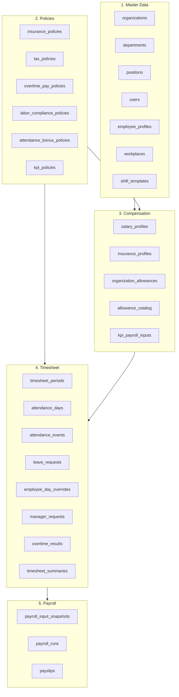

# Payroll Seed Data Flow

> Tài liệu này mô tả: để tính được payroll cho một nhân viên, cần seed dữ liệu gì vào collection nào, và khi tính lương sẽ lấy dữ liệu từ đâu.

---

## 1. Tổng quan flow



---

## 2. Chi tiết từng collection cần seed

### 2.1. Master Data

| Collection | Dữ liệu cần seed | Mục đích |
|------------|------------------|----------|
| `organizations` | `code`, `name`, `timezone`, `status` | Tenant root |
| `departments` | `code`, `name` | Phòng ban |
| `positions` | `code`, `name` | Chức danh |
| `users` | `email`, `fullName`, `role`, `passwordHash` | Auth identity |
| `employee_profiles` | `employeeCode`, `departmentId`, `positionId`, `directManagerId`, `joinDate`, `dependents`, `taxCode`, `bankAccount` | HR business record |
| `workplaces` | `code`, `name`, `type`, `address`, `latitude`, `longitude`, `allowedRadiusMeters` | Nơi làm việc |
| `shift_templates` | `code`, `name`, `startTime`, `endTime`, `breakMinutes`, `weekdays` | Ca làm việc |

### 2.2. Policies

| Collection | Dữ liệu cần seed | Mục đích |
|------------|------------------|----------|
| `insurance_policies` | BHXH 8%, BHYT 1.5%, BHTN 1%, employer rates, cap rules | Tính bảo hiểm |
| `tax_policies` | personal deduction 15.5M, dependent deduction 6.2M, progressive brackets | Tính PIT |
| `overtime_pay_policies` | workingDayRate 1.5, weeklyOffRate 2.0, publicHolidayRate 3.0 | Tính OT pay |
| `labor_compliance_policies` | normalDailyMinutes, max OT limits | Giới hạn pháp lý |
| `attendance_bonus_policies` | tiers, bonusAmount, conditions | Thưởng chuyên cần |
| `kpi_policies` | tiers, baseAmount, percentage | Thưởng KPI |

### 2.3. Compensation

| Collection | Dữ liệu cần seed | Mục đích |
|------------|------------------|----------|
| `allowance_catalog` | `code`, `defaultName`, `defaultTaxable`, `defaultInsuranceBased` | Danh mục phụ cấp |
| `organization_allowances` | `code`, `name`, `amount`, `taxable`, `insuranceBased`, `prorated` | Phụ cấp của tổ chức |
| `salary_profiles` | `baseSalary`, `insuranceSalary`, `allowances`, `attendanceBonusPolicyId` | Lương & phụ cấp của nhân viên |
| `insurance_profiles` | `participatesSocialInsurance`, `participatesHealthInsurance`, `participatesUnemploymentInsurance` | Tham gia bảo hiểm của nhân viên |
| `kpi_payroll_inputs` | `period`, `score`, `tierName`, `tierPercentage`, `amount`, `status` | KPI của nhân viên trong kỳ |

### 2.4. Timesheet

| Collection | Dữ liệu cần seed | Mục đích |
|------------|------------------|----------|
| `timesheet_periods` | `period` (YYYY-MM), `startDate`, `endDate`, `status` | Kỳ chấm công |
| `attendance_days` | `workDate`, `checkInAt`, `checkOutAt`, `workingMinutes`, `dayResult`, `workdayType` | Dữ liệu chấm công/ngày |
| `attendance_events` | `eventType` (CHECK_IN/CHECK_OUT), `recordedAt` | Sự kiện chấm công |
| `leave_requests` | `startDate`, `endDate`, `leaveType`, `status` | Đơn xin nghỉ |
| `leave_actions` | `action`, `previousStatus`, `newStatus` | Lịch sử phê duyệt nghỉ |
| `employee_day_overrides` | `date`, `type`, `reason` | Ghi đè ngày làm việc |
| `manager_requests` | `type: 'OVERTIME'`, `workDate`, `requestedStart`, `requestedEnd`, `status` | Đơn xin OT |
| `overtime_results` | `eligibleMinutes`, `overtimeType`, `classificationStatus` | Kết quả OT đã duyệt |
| `timesheet_summaries` | `workingDays`, `presentDays`, `paidLeaveDays`, `otWorkingDayMinutes`, ... | Tổng hợp công |

### 2.5. Payroll

| Collection | Dữ liệu cần seed | Mục đích |
|------------|------------------|----------|
| `payroll_input_snapshots` | Lương, phụ cấp, bảo hiểm, thuế, OT đóng băng | Input tính lương |
| `payroll_runs` | `periodLabel`, `status`, `runDate`, `totalGross`, `totalNet` | Phiên tính lương |
| `payslips` | `grossEarnings`, `taxableEarnings`, `netSalary`, `earningBreakdown`, `deductionBreakdown`, `pitBreakdown` | Phiếu lương |

---

## 3. Payroll lấy dữ liệu từ đâu?

### 3.1. Tính lương cơ bản

| Dữ liệu cần | Lấy từ collection |
|-------------|-------------------|
| Base salary | `salary_profiles.baseSalary` |
| Ngày làm việc thực tế | `timesheet_summaries.presentDays` |
| Tổng ngày trong tháng | `timesheet_periods.startDate` → `endDate` |
| Prorated salary | `baseSalary / totalDays * presentDays` (hoặc theo policy) |

### 3.2. Tính phụ cấp

| Dữ liệu cần | Lấy từ collection |
|-------------|-------------------|
| Danh sách phụ cấp của nhân viên | `salary_profiles.allowances` |
| Chi tiết phụ cấp | `organization_allowances` |
| Phân loại taxable/non-taxable | `organization_allowances.taxable` |
| Total allowances | Sum của các allowance |

### 3.3. Tính OT pay

| Dữ liệu cần | Lấy từ collection |
|-------------|-------------------|
| Số phút OT theo loại | `timesheet_summaries.otWorkingDayMinutes`, `otWeeklyOffMinutes`, `otPublicHolidayMinutes` |
| Hệ số OT | `overtime_pay_policies.workingDayRate`, `weeklyOffRate`, `publicHolidayRate` |
| Hourly rate | `salary_profiles.baseSalary / (legal working hours)` |
| OT pay | `minutes / 60 * hourlyRate * coefficient` |

### 3.4. Tính bảo hiểm

| Dữ liệu cần | Lấy từ collection |
|-------------|-------------------|
| Có tham gia BHXH/BHYT/BHTN không | `insurance_profiles` |
| Tỷ lệ đóng | `insurance_policies` |
| Contribution base | `salary_profiles.insuranceSalary` capped theo `insurance_policies.capRules` |
| Số tiền bảo hiểm | `contributionBase * rate` |

### 3.5. Tính thuế TNCN

| Dữ liệu cần | Lấy từ collection |
|-------------|-------------------|
| Thu nhập chịu thuế | `grossEarnings - nonTaxableAllowances - insurance - personalDeduction - dependentDeduction` |
| Personal deduction | `tax_policies.personalDeduction` |
| Dependent deduction | `tax_policies.dependentDeduction * activeDependentCount` |
| Số người phụ thuộc | `employee_profiles.dependents` (status = ACTIVE) |
| Progressive brackets | `tax_policies.progressiveBrackets` |
| PIT amount | Tính theo brackets |

### 3.6. Tính lương net

```
netSalary = grossEarnings - socialInsurance - healthInsurance - unemploymentInsurance - pitAmount - otherDeductions
```

---

## 4. Mapping chi tiết cho 1 nhân viên

### Ví dụ: nhân viên `FLOW-ENG-001` - Phạm Anh Tuấn

```
users
  └── _id: userId

employee_profiles
  └── _id: profileId
  ├── userId
  ├── employeeCode: "FLOW-ENG-001"
  ├── departmentId → departments._id (ENG)
  ├── positionId → positions._id (DLEAD)
  ├── directManagerId → users._id
  └── dependents: [...]

salary_profiles
  └── employeeProfileId: profileId
  ├── baseSalary: 35_000_000
  ├── insuranceSalary: 28_000_000
  ├── allowances: [
  │     { allowanceId: PHONE, amount: 1_800_000 },
  │     { allowanceId: FUEL, amount: 300_000 }
  │   ]
  └── attendanceBonusPolicyId → attendance_bonus_policies._id

insurance_profiles
  └── employeeId: profileId
  ├── participatesSocialInsurance: true
  ├── participatesHealthInsurance: true
  └── participatesUnemploymentInsurance: true

timesheet_periods
  └── _id: periodId
  ├── period: "2026-09"
  ├── startDate: 2026-09-01
  └── endDate: 2026-09-30

attendance_days (nhiều records)
  ├── employeeId: userId
  ├── periodId: periodId
  ├── workDate: "2026-09-01"
  ├── checkInAt
  ├── checkOutAt
  └── workingMinutes: 480

overtime_results
  ├── employeeId: userId
  ├── periodKey: "2026-09"
  ├── overtimeType: "OT_WORKING_DAY"
  └── eligibleMinutes: 180

timesheet_summaries
  ├── periodId: periodId
  ├── employeeProfileId: profileId
  ├── userId: userId
  ├── presentDays: 20
  ├── otWorkingDayMinutes: 180
  └── totalOvertimeMinutes: 180

payroll_input_snapshots
  ├── periodId: periodId
  ├── employeeProfileId: profileId
  ├── userId: userId
  ├── monthlyBaseSalary: 35_000_000
  ├── proratedBaseSalary: ...
  ├── totalAllowances: ...
  ├── otPay: ...
  ├── socialInsurance: ...
  ├── taxableEarnings: ...
  └── status: "GENERATED"

payroll_runs
  └── _id: payrollRunId
  ├── timesheetPeriodId: periodId
  ├── periodLabel: "09/2026"
  └── status: "RELEASED"

payslips
  ├── payrollRunId: payrollRunId
  ├── employeeProfileId: profileId
  ├── grossEarnings: ...
  ├── netSalary: ...
  ├── earningBreakdown: [...]
  ├── deductionBreakdown: [...]
  └── pitBreakdown: [...]
```

---

## 5. Các ràng buộc consistency cần đảm bảo

| Vùng | Ràng buộc |
|------|-----------|
| **Lương** | `salary_profiles.baseSalary` → `payroll_input_snapshots.monthlyBaseSalary` → `payslips.grossEarnings` |
| **Phụ cấp** | `salary_profiles.allowances` ↔ `organization_allowances` ↔ `payroll_input_snapshots.allowanceBreakdown` |
| **Bảo hiểm** | `insurance_policies` rates ↔ `payroll_input_snapshots` rates ↔ `payslips` rates |
| **Contribution base** | `salary_profiles.insuranceSalary` capped 52.2M ↔ `payroll_input_snapshots.contributionBase` ↔ `payslips.contributionBase` |
| **Thuế** | `tax_policies` brackets ↔ `payroll_input_snapshots.taxableEarnings` ↔ `payslips.pitAmount` |
| **Công** | `attendance_days` tổng hợp ↔ `timesheet_summaries` |
| **OT** | `overtime_results.eligibleMinutes` ↔ `timesheet_summaries.ot*Minutes` ↔ `payroll_input_snapshots.otMinutesByType` |
| **Nghỉ phép** | `leave_requests` ↔ `employee_day_overrides` ↔ `timesheet_summaries.paidLeaveDays` |
| **Dependents** | `employee_profiles.dependents` (ACTIVE) ↔ `payroll_input_snapshots.dependentCount` ↔ `payslips.dependentDeduction` |
| **Period** | `timesheet_periods.period` ↔ `timesheet_summaries.periodKey` ↔ `payroll_input_snapshots.periodKey` ↔ `payroll_runs.periodLabel` |

---

## 6. Checklist khi seed payroll

- [ ] Organization, departments, positions đã có
- [ ] Users + EmployeeProfiles đã tạo đúng mapping
- [ ] SalaryProfile có `baseSalary`, `insuranceSalary`, `allowances`
- [ ] InsuranceProfile đánh dấu đúng participation
- [ ] InsurancePolicy, TaxPolicy, OvertimePayPolicy, LaborCompliancePolicy đã seed
- [ ] TimesheetPeriod đã tạo với status hợp lệ
- [ ] AttendanceDays + Events đã tạo cho đủ ngày làm việc
- [ ] LeaveRequests + Overrides đã tạo nếu có nghỉ phép
- [ ] ManagerRequests + OvertimeResults đã tạo nếu có OT
- [ ] TimesheetSummary phản ánh đúng tổng từ AttendanceDay + OT + Leave
- [ ] PayrollInputSnapshot đóng băng đúng các giá trị tính lương
- [ ] PayrollRun tạo với đúng periodLabel
- [ ] Payslip tính đúng gross, deductions, net và breakdowns
