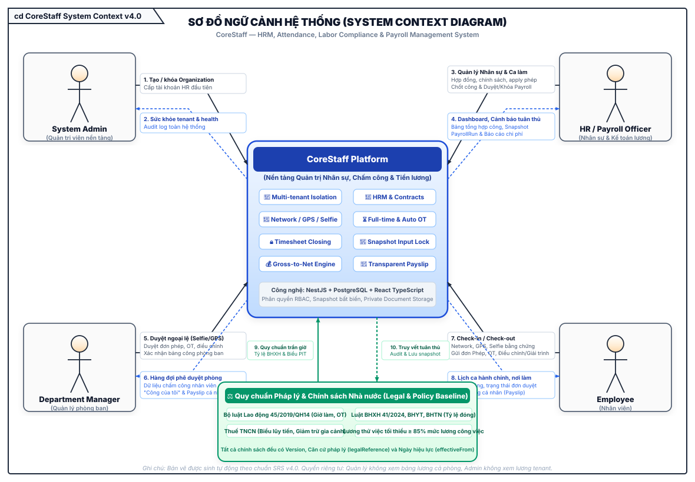
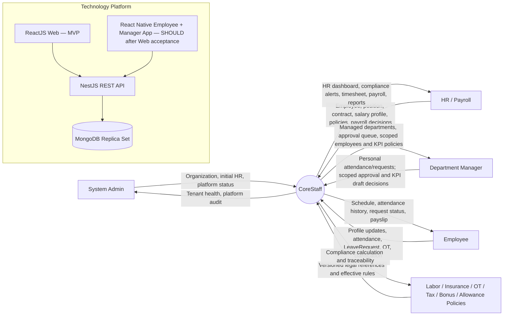

# CoreStaff — Context Diagram v4

> **Baseline:** SRS v4.0 — HRM & Payroll. Toàn bộ sơ đồ đã được cập nhật sang định dạng vector SVG chuẩn kiến trúc v4.0.

[Mở file SVG kích thước đầy đủ](CoreStaff_Context_Diagram.svg)

## Luồng dữ liệu theo actor

### System Admin
- Quản lý Organization và tài khoản HR đầu tiên.
- Xem health/audit nền tảng.
- Không xem hoặc xử lý dữ liệu lương tenant mặc định.

### HR / Payroll
- Quản lý EmployeeProfile, Department, Position, Contract và Document.
- Cấu hình Shift Full-time, Calendar; apply LeaveRequest đã duyệt; quản lý SalaryProfile và policy.
- Rà soát/chốt công, tạo PayrollInputSnapshot.
- Tính, review, approve, lock Payroll và phát hành Payslip.

### Department Manager
- Là nhân viên có thêm quyền quản lý; nhóm Cá nhân gồm Chấm công hôm nay, Lịch sử công, Nghỉ phép & OT.
- Workspace Phòng ban có hai tab: Phê duyệt và Đánh giá nhân sự (KPI kỳ lương).
- Duyệt attendance exception/adjustment/clarification và OT đúng `managedDepartmentIds`; không duyệt từng Network/GPS record hợp lệ.
- ManagerAssignment có hiệu lực là nguồn authorization cho một hoặc nhiều Department; profile department/directManagerId không tự sinh quyền.
- Manager chỉ tạo/sửa KPI DRAFT; HR confirm để đưa vào Payroll.
- Xác nhận bảng công phòng ban; không xem lương/dữ liệu nhạy cảm cả phòng và không tự duyệt request của mình.
- ReactJS responsive desktop/mobile được nghiệm thu trước; Expo chỉ port sau bằng cùng API contract.

### Employee
- Xem/cập nhật phần hồ sơ được phép.
- Check-in/out Network/GPS/Selfie.
- Gửi LeaveRequest/OT/adjustment/clarification.
- Xem lịch sử, bảng công và Payslip cá nhân sau phát hành.

### Policy Sources
- LaborCompliancePolicy, OvertimePayPolicy, InsurancePolicy, TaxPolicy, AttendanceBonusPolicy và OrganizationAllowance (catalog seed + custom) có `effectiveFrom`/`version` (và `legalReference` khi áp dụng pháp lý).
- Seed demo phải được xác nhận lại trước khi triển khai thật.
