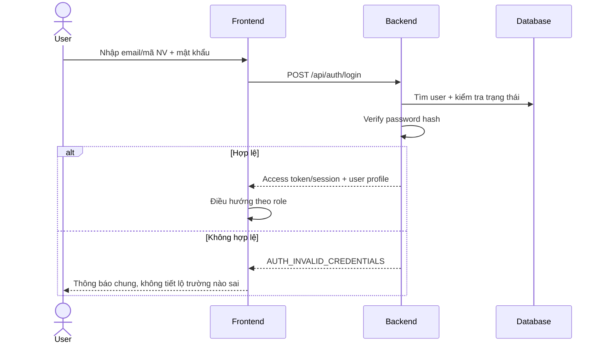

# SRS — CORESTAFF

> **Software Requirements Specification**  
> **CoreStaff — Hệ thống Quản trị Nhân sự, Chấm công và Tiền lương**  
> Tài liệu yêu cầu phần mềm cho dự án SWP391, bao quát toàn bộ quy trình từ cấu hình nhân sự, chấm công Network/GPS/Selfie, phê duyệt ngoại lệ đến rà soát và khóa kỳ công hằng tháng.

---

## 0. Thông tin tài liệu

| Hạng mục | Nội dung |
|---|---|
| Tên hệ thống | **CoreStaff — Human Resource, Attendance & Payroll Management System** |
| Tên tiếng Việt | **CoreStaff — Hệ thống Quản trị Nhân sự, Chấm công và Tiền lương** |
| Loại sản phẩm | Nền tảng web multi-tenant responsive; mobile-first cho Employee, desktop-first cho Department Manager, HR và System Admin |
| Đối tượng | Văn phòng và doanh nghiệp nhỏ có khoảng 10–50 nhân viên trong mỗi Organization; đây là phân khúc mục tiêu, không phải giới hạn kỹ thuật |
| Xác thực | Email hoặc mã nhân viên và mật khẩu |
| Vai trò MVP | `EMPLOYEE`, `DEPARTMENT_MANAGER`, `HR`, `SYSTEM_ADMIN` |
| Phiên bản SRS | **4.0 — HRM & Payroll baseline** |
| Nguồn tham chiếu | `CORESTAFF_PROJECT_PROPOSAL.md`, `CoreStaff_Context_Diagram.md`, `Use case diagram.md`, prototype React trong `protoype/src` (tên thư mục hiện tại) và bảng đề tài FA26_SWP391 |
| Trạng thái | **Baseline triển khai MVP; các mục `【MỞ】` cần nhóm và giảng viên chốt** |

### 0.1. Ký hiệu

| Ký hiệu | Ý nghĩa |
|---|---|
| **【MVP】** | Bắt buộc có trong phiên bản nộp môn học |
| **【SHOULD】** | Nên có nếu đủ thời gian |
| **【LATER】** | Để giai đoạn sau, không ảnh hưởng nghiệm thu MVP |
| **【MỞ】** | Chưa chốt; tài liệu đưa ra giá trị mặc định để có thể bắt đầu làm |

### 0.2. Các quyết định nền tảng

1. CoreStaff là nền tảng **multi-tenant** cung cấp dịch vụ chấm công cho nhiều `Organization`; dữ liệu giữa các tổ chức phải được cô lập tuyệt đối.
2. MVP có bốn vai trò: `SYSTEM_ADMIN`, `HR`, `DEPARTMENT_MANAGER`, `EMPLOYEE`.
3. `SYSTEM_ADMIN` quản trị nền tảng, tạo/khóa Organization và cấp tài khoản HR đầu tiên; không xử lý hoặc chốt công thay khách hàng.
4. `HR` quản trị cơ cấu nhân sự trong Organization, rà soát, chốt/mở lại kỳ và xuất bảng tổng hợp.
5. `DEPARTMENT_MANAGER` là nhân viên có thêm quyền quản lý: dùng cùng một tài khoản để check-in/out, xem “Công của tôi”, xử lý ngoại lệ và xác nhận công của phòng ban được giao.
6. `HR` cũng có thể chấm công cá nhân nếu có `EmployeeAssignment` hợp lệ; `SYSTEM_ADMIN` không thuộc workforce tenant nên không chấm công.
7. `EMPLOYEE` chấm công và chỉ truy cập dữ liệu cá nhân.
8. Department Manager và HR không được tự duyệt ApprovalRequest hoặc AdjustmentRequest của chính mình; request phải chuyển cho HR khác hoặc người quản lý thay thế.
9. Người dùng đăng nhập bằng email hoặc mã nhân viên + mật khẩu; MVP không cho đăng ký công khai.
10. Employee chọn `IN_OFFICE` hoặc `OUT_OFFICE`; bằng chứng thực tế là `NETWORK`, `GPS` hoặc `SELFIE`.
11. Điều chỉnh công và phân loại ngày nghỉ/vắng tối thiểu thuộc MVP để HR có thể làm sạch dữ liệu trước khi chốt.
12. CoreStaff tính lương từ PayrollInputSnapshot đã khóa, bao gồm thu nhập, OT, bảo hiểm bắt buộc, PIT và Payslip.
13. Backend NestJS là nguồn chính thức cho tenant scope, quyền, thời gian, validation và trạng thái kỳ công; MongoDB chạy replica set để bảo đảm transaction.
14. Prototype dùng mock data để trình diễn; dữ liệu mock không phải kiến trúc production.
15. MVP chỉ hỗ trợ nhân viên `FULL_TIME` làm giờ hành chính; HR cấu hình ShiftTemplate, không hard-code 08:00–17:00.
16. Ca `08:00–17:00` chỉ là seed/demo; HR nhập start/end/break, MVP không hỗ trợ ca đêm, ca qua ngày hoặc nhiều ca/ngày.
17. Overtime type do backend tự phân loại từ Calendar và WorkSchedule; Employee không được chọn loại OT.

---

## 1. Giới thiệu

### 1.1. Bối cảnh

Nhiều tổ chức cần cùng một nền tảng chấm công nhưng phải sở hữu dữ liệu, cơ cấu phòng ban, workplace, ca làm và kỳ công riêng. Bảng tính hoặc hệ thống chỉ ghi nhận giờ vào/ra không đủ để xác minh vị trí, xử lý ngoại lệ và khóa dữ liệu cuối tháng.

CoreStaff vận hành theo mô hình:

```text
System Admin tạo Organization và tài khoản HR đầu tiên
→ HR cấu hình Department, Workplace, Shift, Calendar và người dùng trong tenant
→ Employee/Department Manager/HR chấm công cá nhân bằng Network, GPS hoặc Selfie
→ Department Manager xử lý ngoại lệ của phòng ban và xác nhận bảng công
→ HR xử lý adjustment, phân loại nghỉ/vắng và rà soát blocker toàn Organization
→ HR chốt, khóa kỳ và xuất snapshot tổng hợp
```

Mọi request nghiệp vụ phải được ràng buộc bởi `organizationId` lấy từ session. Tenant A không thể đọc hoặc mutation dữ liệu Tenant B dù biết ID tài nguyên.

### 1.2. Mục tiêu sản phẩm

- Xây dựng CoreStaff multi-tenant với authentication, authorization, tenant isolation và phân quyền theo resource.
- Cho phép Employee chấm công bằng web responsive trên điện thoại hoặc máy tính.
- Hỗ trợ làm tại văn phòng và ngoài văn phòng bằng Network, GPS hoặc Selfie.
- Cho phép Department Manager xử lý ngoại lệ và xác nhận dữ liệu của phòng ban được giao.
- Cho phép HR quản lý cơ cấu tenant, lịch công, adjustment, chốt/mở lại kỳ và export.
- Cho phép System Admin quản lý Organization, trạng thái dịch vụ, HR đầu tiên và audit nền tảng.
- Lưu thời gian server, evidence, snapshot và audit để bảo đảm dữ liệu có thể truy vết.
- Chứng minh cô lập dữ liệu giữa ít nhất hai Organization trong demo và kiểm thử.
- Phục vụ tốt tenant mục tiêu 10–50 nhân viên nhưng vẫn dùng pagination và không hard-code giới hạn 50.
- Hỗ trợ lịch Full-time hành chính do HR cấu hình, OT tự động phân loại, chốt công và tính lương thực nhận.

### 1.3. Mục tiêu không thuộc MVP

- Chuyển khoản lương qua ngân hàng và quyết toán PIT năm tự động.
- Leave nâng cao (quota/accrual/half-day/hourly/carry-over/balance tự động). Workflow request → Manager duyệt → HR apply thuộc MVP.
- Nhận diện khuôn mặt hoặc liveness detection bằng AI.
- Theo dõi vị trí liên tục ở nền.
- Chấm công offline rồi đồng bộ sau.
- Đăng nhập mạng xã hội hoặc OAuth.
- Subscription plan, billing, cổng thanh toán và custom domain cho SaaS.
- Ứng dụng native iOS/Android.
- Tích hợp máy chấm công vân tay.

### 1.4. Tiêu chí thành công của đồ án

MVP được xem là thành công khi có thể demo end-to-end:

1. System Admin tạo hai Organization và cấp tài khoản HR đầu tiên cho mỗi tenant.
2. HR tạo Department, Workplace, Shift, Calendar, Department Manager và Employee trong Organization của mình.
3. Employee check-in/out đúng thứ tự bằng GPS/Network; nhân viên ngoài văn phòng gửi Selfie + GPS.
4. Department Manager chỉ xem và xử lý ngoại lệ của phòng ban được giao.
5. Employee tạo AdjustmentRequest cho ngày công sai/thiếu; thay đổi được áp dụng có audit before/after.
6. Employee gửi LeaveRequest → Department Manager approve → HR apply → ngày công `PAID_LEAVE`/`UNPAID_LEAVE` (không ghi override thẳng ngoài workflow).
7. Hệ thống phân biệt ngày làm việc, nghỉ tuần, ngày lễ, nghỉ có phép/không lương, vắng và incomplete.
8. Department Manager xác nhận bảng công phòng ban; HR xem blocker, chốt kỳ và export snapshot.
9. HR mở lại kỳ khi có lý do; kỳ CLOSED chặn mutation trực tiếp.
10. HR-A/Manager-A/Employee-A không thể đọc dữ liệu Organization B dù thay ID hoặc query.
11. Dữ liệu tồn tại sau refresh/khởi động lại và mọi thao tác quan trọng có audit.

---

## 2. Phạm vi hệ thống

### 2.1. Trong phạm vi MVP

#### Nền tảng và tenant

- System Admin tạo, khóa/mở và giám sát Organization.
- System Admin cấp tài khoản HR đầu tiên; không chốt hoặc duyệt công thay tenant.
- Mọi tài nguyên nghiệp vụ được cô lập bằng `organizationId` lấy từ session.
- Seed tối thiểu hai Organization để chứng minh tenant isolation.

#### Tài khoản và cơ cấu tổ chức

- Đăng nhập/đăng xuất, hồ sơ, đổi/reset mật khẩu và RBAC.
- HR quản lý Department, Employee và Department Manager trong tenant.
- HR quản lý Workplace, Network/CIDR, ShiftTemplate và assignment có hiệu lực theo thời gian.
- HR cấu hình ca theo nhu cầu Organization; 08:00–17:00 chỉ là seed, không phải business rule.
- Full-time dùng RecurringSchedule do HR cấu hình; WorkSchedule chính thức được sinh theo ngày.
- Không hỗ trợ đăng ký/đổi ca trong MVP; HR điều chỉnh lịch hành chính qua workflow có audit khi cần.
- Employee/Manager/HR có assignment được gửi OvertimeRequest; backend tự phân loại và tính eligible OT.
- Giữ snapshot Organization/Department/Shift/Workplace trên dữ liệu lịch sử.

#### Lịch công tối thiểu

- Cấu hình ngày làm việc trong tuần và ngày lễ của Organization.
- Employee tạo LeaveRequest; Department Manager approve/reject đúng scope; HR apply thành EmployeeDayOverride `PAID_LEAVE`/`UNPAID_LEAVE`.
- Hệ thống phân loại `WORKING_DAY`, `WEEKLY_OFF`, `PUBLIC_HOLIDAY`, `PAID_LEAVE`, `UNPAID_LEAVE`, `ABSENT`, `INCOMPLETE`.

#### Employee

- Check-in/out bằng Network, GPS hoặc Selfie + GPS.
- Xem lịch sử, chi tiết, trạng thái phê duyệt và tổng hợp cá nhân.
- Gửi giải trình và tạo AdjustmentRequest cho ngày sai/thiếu.

#### Department Manager

- Dùng một tài khoản duy nhất cho cả quyền nhân viên và quyền quản lý.
- Check-in/out, xem lịch sử, tổng hợp cá nhân, giải trình và adjustment qua khu vực “Công của tôi” nếu có `EmployeeAssignment` hợp lệ.
- Xử lý approval/adjustment của các Department được giao, nhưng không được tự xử lý request có `employeeId` bằng chính `userId` của mình.
- Request cá nhân của Department Manager được chuyển cho HR khác hoặc người quản lý thay thế được cấu hình.
- Xem evidence/audit đúng tenant và department scope.
- Xác nhận bảng công phòng ban khi không còn blocker.

#### HR với tư cách nhân viên

- HR được dùng các chức năng “Công của tôi” nếu có `EmployeeAssignment` hợp lệ.
- HR không có assignment thì chỉ dùng chức năng quản trị nhân sự/chốt công và không hiện nút check-in/out.
- HR không được tự duyệt hoặc tự áp dụng ApprovalRequest/AdjustmentRequest của chính mình.
- `SYSTEM_ADMIN` không có EmployeeAssignment trong tenant và không có chức năng chấm công.

#### HR và chốt kỳ công

- Rà soát toàn Organization, xử lý blocker và áp dụng adjustment đã duyệt.
- Tạo, chốt/mở lại kỳ công theo tháng; mở lại bắt buộc có lý do và audit.
- Tạo `TimesheetSummary` snapshot và export CSV bắt buộc; XLSX là SHOULD.
- Thay đổi dữ liệu làm tăng period version và vô hiệu xác nhận phòng ban cũ.

#### HRM, hợp đồng và tiền lương

- Quản lý EmployeeProfile, Position, EmploymentContract và EmployeeDocument private.
- Nhân viên chỉ có trạng thái `PROBATION` hoặc `ACTIVE` khi đang làm việc; giữ `RESIGNED`/`TERMINATED` cho lịch sử.
- HR cấu hình SalaryProfile, phụ cấp, chuyên cần, KPI, lương đóng bảo hiểm và hồ sơ thuế.
- Chốt công tạo PayrollInputSnapshot bất biến; PayrollRun tính gross, insurance, PIT, net salary và employer cost.
- HR review/approve/lock payroll; Employee xem Payslip cá nhân sau phát hành.
- Policy lao động/bảo hiểm/thuế/OT có ngày hiệu lực, version và legalReference.

#### Hệ thống

- Backend cung cấp thời gian chính thức, transaction, idempotency và audit.
- Evidence là private resource; kiểm tra tenant/resource authorization khi truy cập.
- Kỳ CLOSED chặn mutation trực tiếp; mọi query từ chối truy cập chéo tenant.

### 2.2. SHOULD

- Quên mật khẩu bằng email có token hết hạn.
- Dashboard nâng cao theo tenant, phòng ban và kỳ.
- Notification trong ứng dụng; email/push notification.
- Refresh token/session rotation.
- Export XLSX và bản nháp có watermark `DRAFT`.
- Một Department Manager tạm thời phụ trách nhiều phòng ban.
- Cảnh báo giới hạn OT theo policy nội bộ của Organization.

### 2.3. LATER

- Subscription plan, billing, cổng thanh toán và custom domain.
- Leave nâng cao: quota/accrual, half-day/hourly leave, carry-over và balance tự động; MVP vẫn có request → Manager duyệt → HR apply.
- Nhiều ca trong ngày hoặc ca qua đêm.
- Nhận diện khuôn mặt/liveness.
- Payroll nâng cao đa quốc gia, hồi tố phức tạp và quyết toán PIT năm.
- Chấm công offline rồi đồng bộ.
- Ứng dụng native và tích hợp máy chấm công.

---

## 3. Actors và phân quyền

### 3.1. Danh sách vai trò

| Role | Phạm vi | Quyền chính |
|---|---|---|
| `SYSTEM_ADMIN` | Toàn nền tảng | Quản lý Organization, trạng thái dịch vụ, HR đầu tiên và audit kỹ thuật; không xử lý công |
| `HR` | Một Organization | Quản lý cơ cấu/nhân sự, lịch công, apply leave/adjustment, chính sách thu nhập, chốt công và Payroll |
| `DEPARTMENT_MANAGER` | Các Department được giao trong một Organization | Chấm công cá nhân; duyệt attendance/leave/OT/adjustment và xác nhận bảng công |
| `EMPLOYEE` | Bản thân trong một Organization | Chấm công, xem dữ liệu cá nhân, gửi LeaveRequest, giải trình và yêu cầu điều chỉnh |

### 3.2. Ma trận quyền

| Chức năng | Employee | Department Manager | HR | System Admin |
|---|:---:|:---:|:---:|:---:|
| Chấm công/xem công cá nhân | ✅ | ✅ | ✅ nếu có assignment | ❌ |
| Xem công người khác | ❌ | Department được giao | Toàn Organization | ❌ mặc định |
| Xem evidence | Của mình | Request đúng scope | Khi xử lý nghiệp vụ | Chỉ support có audit |
| Approve/reject/clarify | ❌ | Đúng department | Override có lý do | ❌ |
| Duyệt adjustment | ❌ | Bước quản lý | Áp dụng/quyết định cuối | ❌ |
| Leave request | Tạo/xem của mình | Approve/reject đúng Department | Apply vào ngày công | ❌ |
| Xác nhận bảng công phòng ban | ❌ | ✅ | Theo dõi/override có lý do | ❌ |
| Quản lý Department/Employee/Shift | ❌ | Chỉ xem | ✅ trong tenant | ❌ |
| Quản lý Organization | ❌ | ❌ | Xem tenant mình | ✅ |
| Tạo tài khoản HR đầu tiên | ❌ | ❌ | ❌ | ✅ |
| Rà soát/chốt/mở lại kỳ | Xem cá nhân | Xem phòng ban | ✅ | ❌ |
| Quản lý hồ sơ/hợp đồng/salary profile | Xem cá nhân | Chỉ dữ liệu không nhạy cảm | ✅ | ❌ |
| Tính/duyệt/khóa Payroll | Xem Payslip đã phát hành | ❌ | ✅ theo capability | ❌ |
| Xem lương người khác | ❌ | ❌ mặc định | ✅ theo payroll scope | ❌ |
| Export chính thức | Cá nhân | Phòng ban | Toàn Organization | ❌ |
| Xem audit | Cá nhân đã lọc | Department scope | Organization scope | Audit nền tảng |

### 3.3. Nguyên tắc phân quyền và tenant isolation

- Backend kiểm tra role, `organizationId` và resource scope ở từng API.
- `organizationId`, `employeeId` và role tin cậy lấy từ session/token, không lấy từ payload.
- Mọi query nghiệp vụ ràng buộc `resource.organizationId = currentUser.organizationId` trước khi kiểm tra quyền chi tiết.
- Department Manager chỉ xử lý tài nguyên có `departmentId` thuộc `managedDepartmentIds` tại thời điểm hiệu lực.
- Quyền chấm công cá nhân được xác định bởi capability `attendance:self` kết hợp `EmployeeAssignment` còn hiệu lực, không chỉ dựa vào tên role.
- Mọi quyết định approval/adjustment phải thỏa `actorId != employeeId`; hệ thống không hiển thị action và backend trả `SELF_APPROVAL_FORBIDDEN` nếu người xử lý là chủ bản ghi.
- Request do Department Manager/HR tự phát sinh không giao lại chính họ: hệ thống ưu tiên `ApprovalDelegation` còn hiệu lực; nếu không có thì đưa vào HR approval queue chung của Organization. Actor xử lý vẫn phải khác employeeId.
- HR chỉ thao tác trong Organization của mình; HR không thể chọn `organizationId` tùy ý.
- System Admin thao tác Organization ở namespace nền tảng; truy cập dữ liệu/evidence tenant chỉ qua support có lý do và audit.
- Chỉ HR chốt/mở lại kỳ; System Admin không quyết định nghiệp vụ công.
- Tài nguyên ngoài tenant trả `404 RESOURCE_NOT_FOUND` để giảm rò rỉ định danh.
- Unique constraint, object-storage key và cache key phải bao gồm `organizationId`.

---

## 4. Authentication và quản lý phiên

### 4.1. Chính sách tạo tài khoản

**MVP: System Admin cấp HR đầu tiên; HR cấp tài khoản nội bộ tenant.**

```text
System Admin tạo Organization + HR đầu tiên
→ HR tạo Department Manager/Employee trong tenant
→ hệ thống sinh user ACTIVE với mật khẩu tạm thời
→ user đăng nhập lần đầu và đổi mật khẩu
→ session gắn userId + organizationId + role
```

Lý do không mở đăng ký công khai trong MVP:

- Đây là hệ thống dùng nội bộ trong từng Organization.
- Mọi user nghiệp vụ phải thuộc một Organization; Employee cần department/workplace/shift/manager.
- Tránh tăng phạm vi xác minh email, chống spam và quy trình phê duyệt đăng ký.

### 4.2. Định danh đăng nhập

User có thể đăng nhập bằng một trong hai giá trị:

- `email`; hoặc
- `employeeCode`.

Email và employeeCode được so sánh không phân biệt hoa thường và unique trong phạm vi Organization: `UNIQUE INDEX(organizationId, email)` và `UNIQUE INDEX(organizationId, employeeCode)`. Identifier trùng giữa hai tenant được phép; cơ chế login phải xác định tenant bằng organization code/domain hoặc bước chọn Organization.

### 4.3. Luồng đăng nhập



### 4.4. Yêu cầu mật khẩu

| Quy tắc | Giá trị MVP |
|---|---|
| Độ dài tối thiểu | 8 ký tự |
| Thành phần | Ít nhất 1 chữ và 1 số |
| Lưu trữ | Chỉ lưu hash bằng Argon2id hoặc bcrypt; không lưu plaintext |
| Mật khẩu tạm thời | Bắt buộc đổi ở lần đăng nhập đầu |
| So sánh | Thực hiện bằng thư viện password hashing chuẩn |
| Log | Không log password hoặc request body login |

### 4.5. Session/token

Có thể chọn một trong hai cách triển khai, nhưng MVP phải dùng nhất quán:

**Khuyến nghị cho web:** access token ngắn hạn trong cookie `HttpOnly`, `Secure`, `SameSite=Lax` và refresh/session server-side.

Nếu dùng JWT Bearer token:

- Access token hết hạn trong 15–30 phút.
- Refresh token lưu trong HttpOnly cookie, có rotation.
- Frontend không lưu refresh token vào `localStorage`.
- Token chứa tối thiểu `sub`, `role`, `iat`, `exp`; dữ liệu hồ sơ lấy từ backend.

Với đồ án cần giảm độ phức tạp, có thể dùng session ID trong HttpOnly cookie và bảng `UserSession` trong database.

### 4.6. Đăng xuất

- `POST /api/auth/logout` vô hiệu hóa session/refresh token hiện tại.
- Frontend xóa state/cache nhạy cảm và điều hướng về `/login`.
- Nút Back của trình duyệt không được hiển thị lại dữ liệu bảo vệ nếu chưa xác thực.

### 4.7. Khóa tài khoản và chống brute force

- User có `status = ACTIVE | LOCKED | DISABLED`.
- Sau 5 lần đăng nhập sai liên tiếp trong 15 phút, khóa đăng nhập tạm thời 15 phút.
- System Admin có thể khóa/mở khóa thủ công.
- Thông báo login sai phải dùng nội dung chung để tránh dò tài khoản.
- Lưu audit cho login thành công, thất bại, logout, đổi mật khẩu và reset mật khẩu; không lưu password.

### 4.8. Đổi và đặt lại mật khẩu

**MVP bắt buộc:**

- User đổi mật khẩu bằng mật khẩu hiện tại.
- System Admin đặt mật khẩu tạm thời mới.
- Khi System Admin reset, các session cũ của user bị thu hồi.

**SHOULD:**

- Quên mật khẩu qua token một lần, hết hạn sau 15 phút.
- Response luôn chung chung dù email có tồn tại hay không.

---

## 5. Mô hình chấm công

### 5.1. Work mode

| WorkMode | Tên hiển thị | Ngữ cảnh | Cách xác minh |
|---|---|---|---|
| `IN_OFFICE` | Làm tại văn phòng | User có mặt tại workplace | Ưu tiên Network, sau đó GPS; có thể fallback Selfie |
| `OUT_OFFICE` | Làm bên ngoài | Đi thị trường/công tác/remote | Selfie + vị trí làm bằng chứng |

### 5.2. Attendance method

| Method | Dữ liệu chính | Kết quả mặc định |
|---|---|---|
| `NETWORK` | Public IP backend quan sát được | Tự động ghi nhận nếu IP hợp lệ |
| `GPS` | Latitude, longitude, accuracy | Tự động ghi nhận nếu geofence hợp lệ |
| `SELFIE` | Ảnh mới + GPS + server time | Ghi nhận và tạo yêu cầu `PENDING` |

`WorkMode` là lựa chọn nghiệp vụ của user. `AttendanceMethod` là loại bằng chứng cuối cùng do backend xác định và lưu.

### 5.3. Quy tắc chọn method cho IN_OFFICE

```text
Nếu request đi qua mạng được phép
  → NETWORK
Ngược lại nếu có GPS trong geofence và accuracy đạt
  → GPS
Ngược lại
  → yêu cầu SELFIE fallback
```

Seed MVP đặt `allowSelfieFallback = true`. HR được phép tắt theo Workplace; khi tắt và cả Network/GPS không hợp lệ, backend trả lỗi validation và không tạo AttendanceEvent.

### 5.4. Quy tắc OUT_OFFICE

- Bắt buộc chụp ảnh mới cho mỗi check-in/check-out.
- Bắt buộc lấy vị trí mới tại thời điểm thao tác.
- Vị trí là bằng chứng, không yêu cầu nằm trong geofence.
- Check-in và check-out có thể ở hai địa điểm khác nhau.
- Khoảng cách lớn chỉ tạo warning cho Department Manager, không tự động reject.
- Selfie không thực hiện nhận diện khuôn mặt trong MVP.

### 5.5. Quy tắc giữ WorkMode

- User chọn WorkMode khi check-in.
- `AttendanceDay.workMode` được cố định sau check-in.
- Check-out sử dụng WorkMode đã lưu; user không tự đổi mode giữa ngày trong MVP.
- HR xử lý thay đổi qua AdjustmentRequest; mọi sửa đổi phải có audit.

---

## 6. Ca làm việc và ngày công

### 6.1. Employment type

```text
EmploymentType = FULL_TIME
```

- MVP chỉ hỗ trợ `FULL_TIME`; giờ làm cụ thể do HR cấu hình, không quyết định bởi employment type.
- HR cấu hình ShiftTemplate cho từng Organization; hệ thống không hard-code ca hành chính.
- Ca `08:00–17:00`, nghỉ 60 phút và grace 5 phút chỉ là seed/demo có thể sửa hoặc thay thế.

### 6.2. ShiftTemplate và giới hạn MVP

```text
ShiftTemplate
- name, startTime, endTime
- breakMinutes, gracePeriodMinutes
- active
```

- Ca phải bắt đầu và kết thúc trong cùng ngày.
- Không hỗ trợ ca qua đêm.
- Một Employee tối đa một WorkSchedule mỗi ngày trong MVP.
- Không cho WorkSchedule chồng lấn.
- Không có check-in/check-out riêng cho nghỉ giữa ca; `breakMinutes` được trừ theo cấu hình.

### 6.3. Lịch Full-time hành chính

```text
HR tạo ShiftTemplate
→ HR gán RecurringSchedule
→ hệ thống sinh WorkSchedule theo ngày
→ Employee check-in/out theo lịch chính thức
```

- RecurringSchedule gồm weekdays và thời gian hiệu lực.
- Department Manager xem lịch nhân viên thuộc phòng nhưng HR là người cấu hình/gán ca trong MVP.
- Lịch thay đổi không được sửa snapshot của ngày công cũ.

### 6.4. Tính đi trễ/về sớm/giờ làm

```text
lateMinutes = max(0, checkInAt - (scheduleStart + gracePeriod))
earlyMinutes = max(0, scheduleEnd - checkOutAt)
workingMinutes = max(0, checkOutAt - checkInAt - breakMinutes)
```

Backend tính theo WorkSchedule snapshot, không theo 17:00 hay một ca hard-code. Nếu chưa check-out, `workingMinutes = null`; `0` là kết quả đã tính bằng không.

### 6.5. Ngày làm việc

- Work date theo timezone của Organization, mặc định `Asia/Ho_Chi_Minh`.
- Calendar, leave override và WorkSchedule quyết định nghĩa vụ làm việc.
- Ngày không có nghĩa vụ làm việc là `DAY_OFF`; ngày phải làm nhưng thiếu event được phân loại `ABSENT` hoặc `INCOMPLETE`.

---

## 7. State machine

### 7.1. Attendance status

```text
NOT_CHECKED_IN
  └── check-in hợp lệ → CHECKED_IN

CHECKED_IN
  └── check-out hợp lệ → COMPLETED

Trạng thái không thao tác:
DAY_OFF
LOCKED
```

| Status | Available action | Ý nghĩa |
|---|---|---|
| `NOT_CHECKED_IN` | `CHECK_IN` | Chưa vào ca |
| `CHECKED_IN` | `CHECK_OUT` | Đang trong ca |
| `COMPLETED` | `NONE` | Đã hoàn tất ngày công |
| `DAY_OFF` | `NONE` | Không có ca |
| `LOCKED` | `NONE` | Ngày/kỳ công đã khóa |

### 7.2. Approval status

Approval tách khỏi Attendance status:

```text
NOT_REQUIRED                         (NETWORK/GPS hợp lệ)
PENDING
  ├── APPROVED
  ├── REJECTED
  └── CLARIFICATION_REQUESTED
        └── employee phản hồi → PENDING
```

- Selfie check-in ở trạng thái `PENDING` không chặn check-out.
- Mỗi event có approval status riêng.
- Ngày công có `overallApprovalStatus` được tổng hợp từ các event/request theo thứ tự ưu tiên bất lợi nhất: `REJECTED > CLARIFICATION_REQUESTED > PENDING > APPROVED > NOT_REQUIRED`.
- `REJECTED` không xóa event; đây là blocker cho đến khi Manager reopen-for-clarification hoặc HR resolve có lý do/audit.

### 7.3. User status

```text
ACTIVE
LOCKED
DISABLED
```

- `LOCKED`: khóa tạm hoặc system admin khóa, không đăng nhập được.
- `DISABLED`: tài khoản ngừng sử dụng; dữ liệu cũ vẫn được giữ.
- Không hard-delete user đã có attendance records.

### 7.4. Timesheet period status

```text
OPEN → REVIEWING → READY_TO_CLOSE → CLOSED
                     ↑               │
                     └── HR mở lại có lý do ──┘
```

- Hệ thống tự suy ra `READY_TO_CLOSE` khi không còn blocker và mọi Department bắt buộc đã xác nhận đúng version.
- Thay đổi attendance/calendar/adjustment làm tăng version và đưa kỳ về `REVIEWING`.

### 7.5. Workday classification và adjustment

```text
WorkdayType: WORKING_DAY | WEEKLY_OFF | PUBLIC_HOLIDAY | PAID_LEAVE | UNPAID_LEAVE
DayResult: PRESENT | ABSENT | INCOMPLETE
Adjustment: PENDING_MANAGER → APPROVED | REJECTED; APPROVED → APPLIED
```

### 7.6. Leave request

```text
PENDING_MANAGER → APPROVED → HR_APPLIED
                └→ REJECTED
```

`APPROVED` chỉ là quyết định Manager; chỉ `HR_APPLIED` mới tạo EmployeeDayOverride và ảnh hưởng Timesheet/Payroll.

### 7.7. Overtime

```text
OvertimeRequest: PENDING → APPROVED | REJECTED | CANCELLED
OvertimeResult: PROVISIONAL → FINAL
```

Loại tự động: `OT_WORKING_DAY | OT_WEEKLY_OFF | OT_PUBLIC_HOLIDAY`. Employee không gửi `overtimeType` như dữ liệu tin cậy.

---

## 8. Yêu cầu chức năng — Authentication

### FR-AUTH-01 — Đăng nhập 【MVP】

- User nhập email/mã nhân viên và mật khẩu.
- Hệ thống validate dữ liệu bắt buộc.
- Credential đúng và user ACTIVE → tạo session.
- Credential sai → trả lỗi chung.
- User có `mustChangePassword = true` → chỉ được vào màn hình đổi mật khẩu.

**Acceptance criteria**

```gherkin
Given một tài khoản ACTIVE với mật khẩu hợp lệ
When user gửi thông tin đăng nhập đúng
Then hệ thống tạo phiên đăng nhập
And trả thông tin user không chứa passwordHash
And điều hướng user đến trang phù hợp với role
```

### FR-AUTH-02 — Đăng xuất 【MVP】

- Vô hiệu hóa session hiện tại.
- Xóa cache user ở client.
- API bảo vệ sau đó phải trả `401 UNAUTHORIZED`.

### FR-AUTH-03 — Đổi mật khẩu 【MVP】

- Yêu cầu mật khẩu hiện tại, mật khẩu mới và xác nhận.
- Mật khẩu mới phải đạt policy và khác mật khẩu hiện tại.
- Sau đổi thành công, có thể thu hồi các session khác.

### FR-AUTH-04 — Reset mật khẩu tạm thời 【MVP】

- System Admin reset cho tài khoản HR đầu tiên và tài khoản nền tảng.
- HR reset cho Employee/Department Manager trong Organization của mình; không reset được HR khác hoặc tài khoản nền tảng.
- Tạo mật khẩu tạm thời đạt policy, đặt `mustChangePassword = true` và thu hồi session đang hoạt động của tài khoản đó.

### FR-AUTH-05 — Quên mật khẩu 【SHOULD】

- User nhập email.
- Hệ thống tạo token một lần, lưu dạng hash, có hạn 15 phút.
- Không tiết lộ email có tồn tại hay không.

### FR-AUTH-06 — Bảo vệ route 【MVP】

- Guest chỉ truy cập login/reset password và màn chọn Organization nếu dùng chung domain.
- Employee routes yêu cầu authenticated user trong tenant.
- Department Manager routes yêu cầu `DEPARTMENT_MANAGER` hoặc `HR` trong đúng Organization.
- HR routes chỉ cho `HR` cùng Organization.
- Platform routes chỉ cho `SYSTEM_ADMIN`.
- Frontend redirect không thay thế kiểm tra tenant/resource scope ở backend.

---

## 9. Yêu cầu chức năng — System Admin, Organization và HR configuration

### FR-SYS-01 — Quản lý Organization 【MVP】

- System Admin xem danh sách tenant có phân trang; tạo, sửa tên/code và khóa/mở Organization.
- `organizationCode` unique toàn nền tảng; dữ liệu Organization bị khóa vẫn được giữ.
- Khóa Organization làm session nghiệp vụ bị từ chối ở request kế tiếp.

### FR-SYS-02 — Cấp tài khoản HR đầu tiên 【MVP】

- System Admin tạo HR đầu tiên cho Organization và mật khẩu tạm thời.
- Không tạo Employee/Department Manager thay HR trong flow thông thường.
- Không cho vô hiệu hóa System Admin cuối cùng.

### FR-SYS-03 — Giám sát và hỗ trợ 【MVP】

- Xem trạng thái tenant, số user, dung lượng evidence và lỗi vận hành tổng hợp.
- Truy cập dữ liệu tenant chỉ qua support mode có ticket/lý do, thời hạn và audit.
- System Admin không approve/reject, không chốt/mở kỳ và không sửa AttendanceDay.

### FR-HRCFG-01 — Quản lý Department 【MVP】

- HR CRUD mềm Department trong tenant; code unique theo Organization.
- Gán một hoặc nhiều manager theo thời gian hiệu lực; hỗ trợ phòng chưa có manager nhưng tạo blocker khi chốt.

### FR-HRCFG-02 — Quản lý user tenant 【MVP】

- HR tạo/sửa/khóa Employee và Department Manager trong Organization.
- HR không tạo SYSTEM_ADMIN hoặc đổi organizationId của user.
- Không hard-delete user đã có lịch sử.

### FR-HRCFG-03 — Workplace, Network và Shift 【MVP】

- HR CRUD mềm Workplace, allowed network/CIDR và Shift trong tenant.
- Latitude `[-90,90]`, longitude `[-180,180]`, radius mặc định 100m, maximum accuracy 80m.
- Entity đang được tham chiếu chỉ inactive, không hard-delete.

### FR-HRCFG-04 — Assignment có hiệu lực 【MVP】

- Gán Employee vào Department, Workplace, Shift và Department Manager với `effectiveFrom/effectiveTo`.
- Không cho hai assignment active chồng lấn của cùng loại với một Employee.
- Chuyển phòng/ca không thay đổi snapshot lịch sử.

### FR-HRCFG-05 — Work calendar tối thiểu 【MVP】

- HR cấu hình ngày làm việc tuần và ngày lễ riêng của Organization (`CalendarException`).
- `PAID_LEAVE`/`UNPAID_LEAVE` trên ngày nhân viên **chỉ** sinh từ LeaveRequest đã Manager duyệt và HR apply (`FR-LEAVE-03`); MVP **cấm** HR tạo/sửa/xóa `EmployeeDayOverride` trực tiếp ngoài workflow đó.
- Hệ thống suy ra `ABSENT` hoặc `INCOMPLETE` trên ngày có nghĩa vụ làm việc nhưng thiếu event (sau khi đã xét calendar và leave đã `HR_APPLIED`).

---

## 10. Yêu cầu chức năng — Employee

### FR-EMP-01 — Màn hình hôm nay 【MVP】

Hiển thị:

- Tên, mã nhân viên.
- Ngày và giờ hiển thị.
- Ca được gán.
- Workplace.
- Attendance status.
- Check-in/check-out time.
- WorkMode đã chọn nếu có.
- Method thực tế của từng event.
- Approval status.
- Nút action tương ứng.
- Lý do nút bị khóa.

Đồng hồ client chỉ để tham khảo; thời gian trên event phải dùng server time.

### FR-EMP-02 — Chọn WorkMode 【MVP】

- Khi `NOT_CHECKED_IN`, user chọn `IN_OFFICE` hoặc `OUT_OFFICE`.
- Sau check-in, mode bị khóa cho ngày đó.
- UI giải thích ngắn dữ liệu sẽ được thu thập.

### FR-EMP-03 — Check-in IN_OFFICE 【MVP】

1. FE gửi `workMode = IN_OFFICE`, GPS mới nếu có và idempotency key.
2. Backend lấy user từ session, kiểm tra assignment và trạng thái ngày.
3. Backend tự đọc public IP.
4. Backend chọn Network hoặc GPS.
5. Nếu cả hai không hợp lệ:
   - `allowSelfieFallback = true` → trả `SELFIE_REQUIRED`; FE mở camera;
   - nếu false → trả lỗi validation.
6. Thành công → tạo event và chuyển sang `CHECKED_IN`.

### FR-EMP-04 — Check-in OUT_OFFICE 【MVP】

1. FE yêu cầu quyền camera và GPS.
2. User chụp ảnh mới.
3. FE hiển thị preview và cho chụp lại.
4. User xác nhận.
5. FE upload multipart gồm ảnh, vị trí và idempotency key.
6. Backend validate, lưu file private, tạo event `PENDING` và approval request.
7. Attendance status chuyển `CHECKED_IN`.

### FR-EMP-05 — Check-out 【MVP】

- Chỉ khi status là `CHECKED_IN`.
- Dùng WorkMode đã lưu từ check-in.
- Thu thập bằng chứng mới; không tái sử dụng ảnh/GPS check-in.
- Thành công → status `COMPLETED`, backend tính working/late/early minutes.
- Nếu Selfie, tạo/cập nhật approval request theo thiết kế dữ liệu đã chọn.

### FR-EMP-06 — Camera và Selfie 【MVP】

- Ưu tiên camera trước bằng `facingMode: user`.
- Không cung cấp file picker trong flow chính.
- Cho phép preview và retake.
- Dừng media tracks khi đóng camera, submit hoặc unmount.
- Ảnh hợp lệ: JPEG/PNG/WebP; tối đa 5 MB sau xử lý.
- Backend kiểm MIME và file signature.
- Nếu camera bị từ chối, hiển thị hướng dẫn cụ thể.

### FR-EMP-07 — GPS 【MVP】

- Lấy vị trí mới với `maximumAge = 0` trước submit.
- Gửi latitude, longitude, accuracy và `capturedAtClient` để audit.
- Backend tính distance bằng Haversine.
- `capturedAtClient` không phải thời gian công chính thức.
- Không theo dõi vị trí nền.

### FR-EMP-08 — Lịch sử 【MVP】

- Mặc định tháng hiện tại.
- Cho chọn tháng.
- Hiển thị KPI: ngày công, đi trễ, về sớm, ngày nghỉ/vắng nếu có dữ liệu.
- Danh sách gồm ngày, check-in, check-out, tổng phút/giờ, attendance status và approval status.
- Chỉ trả dữ liệu của user hiện tại.

### FR-EMP-09 — Chi tiết ngày công 【MVP】

- Ngày, ca, workplace, work mode.
- Check-in/check-out event.
- Method, server time, vị trí/địa chỉ, accuracy.
- Ảnh Selfie của chính user nếu có.
- Working/late/early minutes.
- Approval status, rejection reason, clarification.
- Audit timeline đã lọc thông tin phù hợp cho Employee.

### FR-EMP-10 — Gửi giải trình 【MVP】

- MVP chỉ cho Employee phản hồi khi request ở `CLARIFICATION_REQUESTED`. Request `REJECTED` là quyết định cuối; chức năng rebuttal/resubmit sau reject là LATER.
- Nội dung bắt buộc, 10–1000 ký tự.
- Sau gửi, request chuyển về `PENDING`.
- Audit lưu người gửi, thời gian và nội dung.

### FR-EMP-11 — Hồ sơ cá nhân 【MVP】

Employee xem:

- Họ tên, email, employeeCode, role.
- Workplace, shift và department manager.
- Có thể sửa avatar/số điện thoại nếu triển khai; không tự sửa role, code, workplace hoặc shift.

---

## 11. Yêu cầu chức năng — Department Manager

### FR-MGR-01 — Danh sách yêu cầu 【MVP】

- Chỉ yêu cầu thuộc Department được giao và cùng Organization.
- Tabs/filter: Pending, Approved, Rejected, Clarification, All.
- Search theo tên, employeeCode hoặc request code.
- Lọc method, ngày và department nếu có.
- Phân trang phía server.
- Hiển thị warning nổi bật.

### FR-MGR-02 — Chi tiết Selfie 【MVP】

Hiển thị:

- Thông tin employee và ca.
- Ảnh check-in/check-out qua endpoint có authorization.
- Server time.
- Tọa độ, địa chỉ, accuracy.
- Khoảng cách giữa hai điểm nếu có cả hai event.
- Employee clarification.
- Adjustment request/review/apply và period version.
- Overtime request, automatic classification và eligible calculation.
- Audit timeline.

### FR-MGR-03 — Chi tiết GPS bất thường 【SHOULD】

- Workplace và geofence.
- Vị trí employee.
- Distance và accuracy.
- Lý do yêu cầu xem xét.
- Có thể dùng sơ đồ/radar đơn giản thay vì dịch vụ bản đồ để giảm phạm vi.

### FR-MGR-04 — Approve 【MVP】

- Chỉ request đang `PENDING` hoặc trạng thái cho phép.
- Backend kiểm tra organizationId, department scope và current status trong transaction.
- Cập nhật request/event/day tương ứng.
- Ghi audit.
- Employee thấy trạng thái mới khi refetch.

### FR-MGR-05 — Reject 【MVP】

- Lý do bắt buộc, 10–1000 ký tự.
- Không xóa evidence/event.
- Cập nhật trạng thái `REJECTED` và audit.
- Không cho reject request đã có quyết định cuối cùng nếu chưa có chức năng reopen.

### FR-MGR-06 — Request clarification 【MVP】

- Nội dung bắt buộc, 10–1000 ký tự.
- Chuyển trạng thái `CLARIFICATION_REQUESTED`.
- Employee được phép gửi phản hồi.
- Sau phản hồi, request trở lại `PENDING`.

### FR-MGR-07 — Duyệt nhanh 【SHOULD】

- Có thể duyệt từ danh sách.
- Nên có hộp xác nhận để tránh thao tác nhầm.
- Không cho reject nhanh mà thiếu lý do.

---

## 11A. Yêu cầu chức năng — HR và chốt kỳ công

### FR-HR-01 — Danh sách kỳ công 【MVP】

- HR xem các kỳ theo tháng, trạng thái, thời điểm tạo/chốt và người thao tác.
- Mỗi tháng chỉ có một kỳ công.
- Trạng thái: `OPEN`, `REVIEWING`, `READY_TO_CLOSE`, `CLOSED`.

### FR-HR-02 — Rà soát kỳ công 【MVP】

- Tổng hợp theo nhân viên/phòng ban: ngày công, working minutes, late minutes, early minutes.
- Hiển thị lỗi chặn: thiếu check-in/out, approval còn Pending hoặc bị REJECTED, clarification chưa hoàn tất.
- Cho phép lọc và mở chi tiết ngày gây lỗi.

### FR-HR-02A — Resolve ngày công bị REJECTED 【MVP】

- `REJECTED` luôn là blocker, không tự chuyển thành ABSENT và không bị xóa.
- Department Manager có thể `reopen-for-clarification` request REJECTED trong department scope; request chuyển `CLARIFICATION_REQUESTED` để Employee phản hồi.
- HR có thể resolve trực tiếp ngày bị REJECTED thành `ABSENT` hoặc kết quả hợp lệ được cấu hình, bắt buộc nhập lý do 10–1000 ký tự.
- HR resolve phải lưu `beforeData`, `afterData`, actor, thời gian và tăng `TimesheetPeriod.version`; mọi DepartmentConfirmation version cũ hết hiệu lực.
- Không cho resolve trong kỳ `CLOSED`; HR phải mở lại kỳ trước.

### FR-HR-03 — Xác nhận phòng ban 【MVP】

- Department Manager chỉ xác nhận khi không còn lỗi chặn trong phạm vi quản lý.
- Mỗi xác nhận lưu department manager, thời gian và snapshot thống kê phòng ban.
- Thay đổi ngày công sau xác nhận làm mất trạng thái xác nhận và yêu cầu rà soát lại.

### FR-HR-04 — Chốt kỳ công 【MVP】

- Chỉ HR thực hiện khi kỳ ở `READY_TO_CLOSE` và tất cả phòng ban bắt buộc đã xác nhận.
- Backend kiểm tra lại toàn bộ blocker trong transaction, không tin kết quả kiểm tra từ frontend.
- Chốt thành công tạo `TimesheetSummary` snapshot cho từng nhân viên và chuyển kỳ sang `CLOSED`.
- Dữ liệu ngày công thuộc kỳ `CLOSED` không được mutation trực tiếp.

### FR-HR-05 — Mở lại kỳ công 【MVP】

- Chỉ HR trong Organization thực hiện; System Admin không có quyền nghiệp vụ này.
- Lý do bắt buộc 10–1000 ký tự.
- Chuyển kỳ từ `CLOSED` về `REVIEWING`, vô hiệu snapshot export cũ và ghi audit.

### FR-HR-06 — Xuất bảng tổng hợp 【MVP】

- HR xuất CSV hoặc XLSX từ snapshot của kỳ đã chốt.
- File gồm kỳ, mã/tên nhân viên, phòng ban, ngày công, working/late/early minutes và trạng thái chốt.
- Tổng trong file phải khớp snapshot database; export không tự tính lại từ dữ liệu đang thay đổi.

### FR-HR-07 — Tổng hợp cá nhân 【MVP】

- Employee xem tổng hợp tháng của chính mình và trạng thái kỳ.
- Employee không xem được tổng hợp của người khác bằng cách đổi ID/query.


### FR-LEAVE-01 — Employee tạo LeaveRequest 【MVP】

- Employee chọn ngày bắt đầu/kết thúc, `PAID_LEAVE` hoặc `UNPAID_LEAVE`, lý do 10–1000 ký tự và evidence tùy chọn.
- MVP chỉ hỗ trợ nghỉ nguyên ngày; half-day/hourly leave, quota/accrual/balance/carry-over là LATER.
- Không cho khoảng ngày ngược, trùng LeaveRequest đang hiệu lực hoặc thuộc kỳ CLOSED.
- Trạng thái ban đầu `PENDING_MANAGER`; request của Manager/HR phải route qua delegation/HR queue và không tự duyệt.

### FR-LEAVE-02 — Manager duyệt LeaveRequest 【MVP】

- Department Manager approve/reject request đúng Organization và Department scope; reject bắt buộc lý do.
- `APPROVED` chưa tự thay đổi ngày công; chờ HR apply.

### FR-LEAVE-03 — HR apply LeaveRequest 【MVP】

- HR apply request `APPROVED`, tạo/cập nhật EmployeeDayOverride cho từng ngày (gắn `leaveRequestId`) và chuyển status `HR_APPLIED` trong một transaction.
- Đây là **đường duy nhất** trong MVP để ghi `PAID_LEAVE`/`UNPAID_LEAVE` vào ngày công; không có API CRUD override độc lập.
- Apply lưu before/after audit, tăng TimesheetPeriod.version và vô hiệu confirmation cũ.
- HR không tự apply request của chính mình; delegation/HR khác xử lý.

### FR-ADJ-01 — Tạo yêu cầu điều chỉnh 【MVP】

- Employee chọn ngày, loại sai sót, thời gian đề xuất, lý do 10–1000 ký tự và evidence tùy chọn.
- Không tạo adjustment cho ngày thuộc tenant khác hoặc kỳ CLOSED; kỳ CLOSED phải được HR mở lại trước.
- Trạng thái: `PENDING_MANAGER`, `APPROVED`, `REJECTED`, `APPLIED`.
- Phân biệt: ADJ-BEFORE-CLOSE là MVP; ADJ-AFTER-CLOSE yêu cầu HR mở lại kỳ (reopen) rồi mới xử lý, mọi thay đổi đều qua audit.

### FR-ADJ-02 — Duyệt và áp dụng điều chỉnh 【MVP】

- Department Manager duyệt/từ chối trong department scope; HR có thể override với lý do.
- HR áp dụng adjustment được duyệt trong transaction, lưu beforeData/afterData và tăng `TimesheetPeriod.version`.
- Mọi DepartmentConfirmation của version cũ hết hiệu lực.


### FR-SCH-01 — HR quản lý ShiftTemplate 【MVP】

- HR tạo/sửa/inactive ca trong tenant; không có giờ ca hard-code.
- Validate start < end trong cùng ngày, break/grace không âm.

### FR-SCH-02 — Lịch Full-time 【MVP】

- Chỉ HR tạo/sửa RecurringSchedule; Department Manager chỉ xem lịch trong department scope.
- Hệ thống sinh WorkSchedule theo weekdays/effective dates, chống trùng và chồng lấn.

### FR-COMP-01 — AttendanceBonusPolicy 【MVP】

- Platform seed các template tier mẫu 100%/70%/50% dựa trên số lần/phút đi trễ, về sớm, absent và incomplete; template chỉ là gợi ý, không phải rule hard-code.
- HR clone template hoặc tạo policy riêng, cấu hình `tiers[]`, `conditions[]`, bonus amount/base và ngày hiệu lực.
- Policy có version; Payroll chỉ đọc version nằm trong PayrollInputSnapshot.

### FR-COMP-02 — Allowance hybrid catalog 【MVP】

- Platform seed AllowanceCatalog chuẩn như ăn trưa, xăng xe, điện thoại; catalog chỉ cung cấp metadata mặc định.
- HR enable/customize catalog item thành OrganizationAllowance hoặc tạo allowance riêng trong tenant.
- OrganizationAllowance cấu hình amount, taxable, insuranceBased, prorated, effective dates và version; SalaryProfile chỉ tham chiếu allowance đã enable cùng tenant.

### FR-OT-01 — Gửi và duyệt OT 【MVP】

- Employee nhập ngày, requested start/end, lý do và mô tả công việc; không được nhập overtimeType.
- Request nên gửi trước giờ bắt đầu OT; duyệt hồi tố được gắn `isRetroactive` và bắt buộc lý do.
- Department Manager duyệt khung thời gian; không được tự duyệt request của mình.

### FR-OT-02 — Tự động phân loại và tính OT 【MVP】

- Backend phân loại theo ưu tiên `PUBLIC_HOLIDAY` → `WEEKLY_OFF/no schedule` → `WORKING_DAY`.
- `eligible interval = approved interval ∩ actual attendance interval − scheduled working interval`.
- Một phút chỉ thuộc một loại OT và `eligibleMinutes` không vượt approvedMinutes.
- Check-out muộn không tự thành OT nếu không có request APPROVED.
- Khi duyệt tạo kết quả `PROVISIONAL`; khi chốt kỳ tính lại thành `FINAL` từ calendar/schedule snapshot cuối.

### FR-OT-03 — Chi tiết OT và bảng công 【MVP】

- Lưu requested, approved, actual và eligible minutes theo từng ngày.
- Tổng hợp riêng `otWorkingDayMinutes`, `otWeeklyOffMinutes`, `otPublicHolidayMinutes`.
- Attendance/Timesheet chỉ lưu requested/approved/actual/eligible minutes (phút). Việc quy đổi sang tiền OT (`OTPay`) do Payroll tính theo `OvertimePayPolicy` có hiệu lực (xem 30D.2).

---

## 12. Business rules

| Mã | Quy tắc |
|---|---|
| BR-AUTH-01 | Mọi API ngoài login/reset đều yêu cầu session hợp lệ. |
| BR-AUTH-02 | Password chỉ được lưu dạng hash. |
| BR-AUTH-03 | User LOCKED/DISABLED hoặc Organization SUSPENDED không được dùng session nghiệp vụ. |
| BR-TENANT-01 | Mọi resource nghiệp vụ thuộc đúng một Organization và mọi query bắt buộc lọc organizationId từ session. |
| BR-TENANT-02 | Truy cập ID ngoài tenant trả 404; không tiết lộ sự tồn tại tài nguyên. |
| BR-TENANT-03 | Unique constraint, cache key và storage key phải được namespaced theo organizationId. |
| BR-RBAC-01 | Quyền được kiểm tra ở backend trên từng resource. |
| BR-SCOPE-01 | Employee chỉ xem và thao tác dữ liệu của chính mình. |
| BR-MGR-01 | Department Manager chỉ xử lý request cùng tenant và thuộc Department được giao tại thời điểm hiệu lực. |
| BR-SELF-APPROVAL-01 | Department Manager và HR không được quyết định hoặc áp dụng request có employeeId bằng actorId của mình. |
| BR-ATTENDANCE-CAPABILITY-01 | EMPLOYEE luôn cần assignment; DEPARTMENT_MANAGER/HR chỉ chấm công khi có EmployeeAssignment hợp lệ; SYSTEM_ADMIN không chấm công. |
| BR-DAY-01 | Một employee chỉ có một AttendanceDay cho mỗi workDate trong Organization. |
| BR-CAL-01 | ABSENT/INCOMPLETE chỉ được suy ra sau calendar và LeaveRequest đã HR_APPLIED; request Pending/Approved chưa apply không đổi ngày công. |
| BR-LEAVE-01 | LeaveRequest đi qua PENDING_MANAGER → APPROVED/REJECTED; APPROVED → HR_APPLIED. |
| BR-LEAVE-02 | Leave apply và self-approval tuân thủ tenant scope, actorId != employeeId, audit và period version. |
| BR-LEAVE-03 | MVP: mọi EmployeeDayOverride leave chỉ sinh từ apply LeaveRequest; cấm tạo/sửa/xóa override trực tiếp. |
| BR-BONUS-01 | Attendance bonus dùng AttendanceBonusPolicy version trong snapshot; template 100/70/50 không hard-code trong engine. |
| BR-ALLOWANCE-01 | Allowance dùng hybrid platform catalog + Organization custom; SalaryProfile không tham chiếu item khác tenant. |
| BR-HIST-01 | Chuyển Department/Shift/Workplace không được làm thay đổi snapshot lịch sử. |
| BR-SHIFT-01 | HR cấu hình ShiftTemplate; 08:00–17:00 chỉ là seed, không phải hằng số nghiệp vụ. |
| BR-SCHEDULE-01 | Một Employee tối đa một WorkSchedule/ngày trong MVP và lịch không được chồng lấn. |
| BR-OT-01 | Employee không chọn overtimeType; backend phân loại từ calendar và schedule snapshot. |
| BR-OT-02 | Không có OvertimeRequest APPROVED thì thời gian ngoài ca không được tính eligible OT. |
| BR-OT-03 | Eligible OT là phần được duyệt giao với attendance thực tế và nằm ngoài scheduled interval. |
| BR-OT-04 | Một phút OT chỉ thuộc một loại; public holiday ưu tiên weekly off và working day. |
| BR-OT-05 | Thay đổi schedule/calendar/OT làm tăng period version và vô hiệu confirmation cũ. |
| BR-ORDER-01 | Không check-out trước check-in. |
| BR-DUP-01 | Không tạo hai check-in hoặc hai check-out hợp lệ cho cùng ngày. |
| BR-MODE-01 | WorkMode được chọn lúc check-in và giữ nguyên đến hết ngày. |
| BR-METHOD-01 | User không tự quyết định method chính thức; backend resolve và lưu. |
| BR-TIME-01 | Thời gian chính thức lấy từ backend/database time. |
| BR-GPS-01 | Backend tính lại distance; không tin distance/insideGeofence từ FE. |
| BR-GPS-02 | GPS hợp lệ khi distance ≤ radius và accuracy ≤ maximumAccuracy. |
| BR-NET-01 | Public IP lấy từ request/proxy đáng tin; không tin IP FE gửi. |
| BR-SELFIE-01 | Mỗi event dùng ảnh mới và vị trí mới. |
| BR-SELFIE-02 | Selfie check-in pending không chặn check-out. |
| BR-SELFIE-03 | Hai địa điểm khác nhau không tự động làm bản ghi bị từ chối. |
| BR-CAM-01 | Selfie phải chụp trực tiếp bằng camera trước (facingMode: user), không cho phép upload từ file picker. Định dạng chấp nhận: JPEG/PNG/WebP; tối đa 5MB sau xử lý. |
| BR-EVID-01 | Evidence private và chỉ truy cập qua authorization. |
| BR-IDEM-01 | Mỗi mutation attendance có Idempotency-Key. |
| BR-PERIOD-01 | Mỗi tháng chỉ có một TimesheetPeriod. |
| BR-PERIOD-02 | Chỉ HR chốt kỳ khi không còn blocker và các phòng ban bắt buộc đã xác nhận. |
| BR-PERIOD-03 | Kỳ CLOSED chặn check-in/out, clarification và chỉnh sửa trực tiếp dữ liệu ngày công. |
| BR-PERIOD-04 | Chỉ HR cùng Organization được mở lại kỳ, bắt buộc có lý do và audit. |
| BR-SNAPSHOT-01 | Export kỳ đã chốt lấy từ TimesheetSummary snapshot, không tính lại tùy thời điểm. |
| BR-ADJ-01 | Mọi sửa ngày công phải đi qua AdjustmentRequest; không chỉnh trực tiếp AttendanceEvent. |
| BR-ADJ-02 | Kỳ CLOSED phải được HR mở lại trước khi áp dụng adjustment. |
| BR-VERSION-01 | Mutation dữ liệu trong kỳ làm tăng period version và vô hiệu DepartmentConfirmation version cũ. |
| BR-AUDIT-01 | Login, cấu hình, chấm công, approval và chốt/mở lại kỳ đều có audit. |
| BR-STATE-01 | FE không tự kết luận mutation thành công khi chưa có response/refetch xác nhận. |
| BR-DELETE-01 | Dữ liệu có lịch sử không hard-delete; dùng trạng thái inactive/disabled. |

---

## 13. Use cases chính

> **Sơ đồ Use Case trực quan:** Xem chi tiết các sơ đồ Mermaid phân theo 4 vai trò tại [Use case diagram.md](./Use case diagram.md) hoặc trên trang Wiki [CoreStaff Project Wiki (Use Case Diagrams)](./index.html#doc-use-case).

### UC-01 — User đăng nhập

| Thuộc tính | Nội dung |
|---|---|
| Actor | Employee / Department Manager / System Admin |
| Tiền điều kiện | User tồn tại và ACTIVE |
| Trigger | User gửi form login |
| Luồng chính | Validate → verify password → tạo session → trả profile → điều hướng |
| Ngoại lệ | Sai credential, user locked, rate limited, server error |
| Hậu điều kiện | Session hợp lệ được tạo; audit login thành công |

### UC-02 — System Admin tạo Organization và HR đầu tiên

| Thuộc tính | Nội dung |
|---|---|
| Actor | System Admin |
| Tiền điều kiện | System Admin đã đăng nhập |
| Luồng chính | Tạo Organization → tạo HR đầu tiên → cấp mật khẩu tạm → audit |
| Ngoại lệ | Organization code trùng; System Admin không hợp lệ |
| Hậu điều kiện | Tenant ACTIVE; HR thuộc tenant và phải đổi mật khẩu |

### UC-03 — Employee check-in tại văn phòng

| Thuộc tính | Nội dung |
|---|---|
| Actor | Employee |
| Tiền điều kiện | Đã login; có assignment; status NOT_CHECKED_IN |
| Luồng chính | Chọn IN → gửi signals → backend validate → resolve method → tạo event |
| Ngoại lệ | Sai network; ngoài geofence; GPS yếu; cần Selfie fallback; duplicate |
| Hậu điều kiện | Status CHECKED_IN; availableAction CHECK_OUT |

### UC-04 — Employee check-in ngoài văn phòng bằng Selfie

| Thuộc tính | Nội dung |
|---|---|
| Actor | Employee |
| Tiền điều kiện | Đã login; status NOT_CHECKED_IN; camera/GPS sẵn sàng |
| Luồng chính | Chọn OUT → chụp → preview → upload → backend lưu → tạo approval request |
| Ngoại lệ | Từ chối quyền; file lỗi/quá lớn; timeout; duplicate |
| Hậu điều kiện | CHECKED_IN + approval PENDING |

### UC-05 — Employee check-out

| Thuộc tính | Nội dung |
|---|---|
| Actor | Employee |
| Tiền điều kiện | Status CHECKED_IN |
| Luồng chính | Thu thập bằng chứng mới → submit → backend validate → tạo OUT event → tính phút |
| Ngoại lệ | Chưa check-in; đã check-out; evidence không hợp lệ |
| Hậu điều kiện | COMPLETED; availableAction NONE |

### UC-06 — Department Manager xử lý Selfie

| Thuộc tính | Nội dung |
|---|---|
| Actor | Department Manager |
| Tiền điều kiện | Request thuộc phạm vi và đang PENDING |
| Luồng chính | Mở detail → xem evidence → approve/reject/clarify → backend transaction + audit |
| Ngoại lệ | Request đã được xử lý bởi tab khác; không có quyền |
| Hậu điều kiện | Trạng thái request/day được cập nhật bền vững |

### UC-07 — Department Manager xác nhận phòng ban

| Thuộc tính | Nội dung |
|---|---|
| Actor | Department Manager |
| Tiền điều kiện | Đã xử lý hết blocker trong phạm vi; kỳ đang REVIEWING |
| Luồng chính | Mở tổng hợp → rà soát → xác nhận → lưu snapshot xác nhận |
| Ngoại lệ | Còn Pending/thiếu check-out; dữ liệu thay đổi đồng thời |
| Hậu điều kiện | Phòng ban được đánh dấu sẵn sàng chốt |

### UC-08 — HR chốt kỳ công

| Thuộc tính | Nội dung |
|---|---|
| Actor | HR |
| Tiền điều kiện | Kỳ READY_TO_CLOSE; mọi phòng ban bắt buộc đã xác nhận |
| Luồng chính | Kiểm tra blocker → lock kỳ → tạo summaries → audit → cho phép export |
| Ngoại lệ | Còn blocker; kỳ đã đóng; xung đột dữ liệu |
| Hậu điều kiện | Kỳ CLOSED; mutation ngày công bị khóa |

### UC-09 — HR mở lại kỳ

| Thuộc tính | Nội dung |
|---|---|
| Actor | HR |
| Tiền điều kiện | Kỳ cùng Organization đang CLOSED |
| Luồng chính | Nhập lý do → xác nhận → kỳ về REVIEWING → invalid export cũ → audit |
| Ngoại lệ | Lý do không hợp lệ; không có quyền |
| Hậu điều kiện | Kỳ được phép rà soát lại nhưng toàn bộ phòng ban phải xác nhận lại |


### UC-10 — Employee yêu cầu điều chỉnh công

| Thuộc tính | Nội dung |
|---|---|
| Actor | Employee |
| Tiền điều kiện | Ngày thuộc tenant và kỳ chưa CLOSED |
| Luồng chính | Chọn ngày/sai sót → nhập dữ liệu đề xuất + lý do → gửi → Manager duyệt → HR áp dụng |
| Ngoại lệ | Ngoài tenant; kỳ đã chốt; dữ liệu đề xuất không hợp lệ |
| Hậu điều kiện | Adjustment APPLIED; lưu before/after; period version tăng |

### UC-11 — OT tự động phân loại

| Thuộc tính | Nội dung |
|---|---|
| Actor | Employee / Department Manager / HR / System |
| Luồng chính | Employee gửi → Manager duyệt → attendance thực tế → hệ thống classify/calculate → HR chốt |
| Ngoại lệ | Tự duyệt; overlap; kỳ CLOSED; không có attendance thực tế |
| Hậu điều kiện | OvertimeResult FINAL nằm trong TimesheetSummary |

### UC-12 — Chứng minh tenant isolation

| Thuộc tính | Nội dung |
|---|---|
| Actor | HR/Manager/Employee của Organization A |
| Tiền điều kiện | Tài nguyên hợp lệ thuộc Organization B tồn tại |
| Luồng chính | User A đổi ID/query để truy cập tài nguyên B |
| Ngoại lệ | Không có |
| Hậu điều kiện | Backend trả 404; không rò rỉ nội dung hoặc metadata của B; audit security event nếu cần |

### UC-13 — LeaveRequest Emp → Manager → HR apply

| Thuộc tính | Nội dung |
|---|---|
| Actor | Employee, Department Manager, HR |
| Tiền điều kiện | Employee ACTIVE trong Organization; kỳ chứa ngày nghỉ chưa CLOSED (hoặc đã reopen) |
| Trigger | Employee gửi LeaveRequest nguyên ngày (`PAID_LEAVE` hoặc `UNPAID_LEAVE`) |
| Luồng chính | Employee tạo request → Manager đúng scope approve → HR apply → tạo EmployeeDayOverride từng ngày + status `HR_APPLIED` + audit |
| Ngoại lệ | Self-approval; sai department scope; trùng request; kỳ CLOSED; apply khi chưa APPROVED; CRUD override trực tiếp bị từ chối |
| Hậu điều kiện | Ngày công phản ánh leave đã apply; TimesheetPeriod.version tăng nếu kỳ đang mở |

---

## 14. Danh sách màn hình và route

### 14.1. Public

| Route | Màn hình | MVP |
|---|---|:---:|
| `/login` | Đăng nhập + xác định Organization | ✅ |
| `/forgot-password`, `/reset-password` | Khôi phục mật khẩu | SHOULD |

### 14.2. Employee dùng chung

| Route | Màn hình | MVP |
|---|---|:---:|
| `/app/attendance` | Hôm nay/check-in/out | ✅ |
| `/app/attendance/history` | Lịch sử và tổng hợp tháng | ✅ |
| `/app/attendance/history/:date` | Chi tiết ngày/evidence/audit | ✅ |
| `/app/adjustments` | Yêu cầu điều chỉnh cá nhân | ✅ |
| `/app/leave`, `/app/leave/:id` | Gửi và xem LeaveRequest cá nhân | ✅ |
| `/app/schedule` | Xem lịch Full-time cá nhân | ✅ |
| `/app/overtime` | Gửi và xem OT cá nhân | ✅ |
| `/app/profile` | Hồ sơ và assignment | ✅ |
| `/app/payslips`, `/app/payslips/:id` | Phiếu lương cá nhân đã phát hành | ✅ |

### 14.3. Department Manager

| Route | Màn hình | MVP |
|---|---|:---:|
| `/manager/approvals` | Queue phê duyệt đúng scope | ✅ |
| `/manager/approvals/:id` | Chi tiết/xử lý | ✅ |
| `/manager/adjustments` | Adjustment phòng ban | ✅ |
| `/manager/leave`, `/manager/leave/:id` | Duyệt LeaveRequest đúng department scope | ✅ |
| `/manager/schedules` | Xem lịch nhân viên phòng ban | ✅ |
| `/manager/overtime` | Duyệt OT và xem kết quả phòng ban | ✅ |
| `/manager/timesheet` | Rà soát và xác nhận phòng ban | ✅ |

### 14.4. HR tenant

| Route | Màn hình | MVP |
|---|---|:---:|
| `/hr/dashboard` | Tổng quan Organization | ✅ |
| `/hr/employees`, `/hr/contracts`, `/hr/documents` | Hồ sơ và hợp đồng | ✅ |
| `/hr/salary-profiles`, `/hr/kpi-inputs` | Cấu hình thu nhập | ✅ |
| `/hr/departments`, `/hr/users` | Cơ cấu và người dùng tenant | ✅ |
| `/hr/workplaces`, `/hr/shifts`, `/hr/calendar` | Cấu hình công | ✅ |
| `/hr/schedules` | ShiftTemplate và RecurringSchedule Full-time | ✅ |
| `/hr/overtime` | Rà soát OT toàn Organization | ✅ |
| `/hr/adjustments` | Duyệt cuối/áp dụng điều chỉnh | ✅ |
| `/hr/leave-requests`, `/hr/leave-requests/:id` | Apply LeaveRequest đã duyệt (không CRUD override thẳng) | ✅ |
| `/hr/periods`, `/hr/periods/:id` | Rà soát/chốt/mở lại kỳ | ✅ |
| `/hr/periods/:id/export` | Export snapshot bảng công | ✅ |
| `/hr/payroll-runs`, `/hr/payroll-runs/:id` | Tính/review/khóa Payroll | ✅ |
| `/hr/payroll-runs/:id/export` | Export bảng lương/Payslip | ✅ |

### 14.5. System Admin platform

| Route | Màn hình | MVP |
|---|---|:---:|
| `/platform/organizations` | Quản lý Organization | ✅ |
| `/platform/organizations/:id` | Trạng thái tenant/HR đầu tiên | ✅ |
| `/platform/audit-logs` | Audit nền tảng/support mode | ✅ |

### 14.6. Điều hướng

- Employee → `/app/attendance`.
- Department Manager → `/manager/approvals`; menu bắt buộc có “Công của tôi” trỏ tới `/app/attendance` cùng lịch sử/adjustment cá nhân.
- HR → `/hr/dashboard`; menu có “Công của tôi” và employee routes khi có EmployeeAssignment hợp lệ; nếu không có assignment thì ẩn action chấm công.
- System Admin → `/platform/organizations`; không có route nghiệp vụ chấm công.
- Route trái role hoặc tenant scope trả 403/404 phù hợp; guest về `/login`.

---

## 15. Data model logic

> **Quy ước MongoDB:** `ObjectId ref X` là tham chiếu Mongoose tới collection X; `UNIQUE INDEX(...)` là compound unique index của MongoDB, không phải SQL constraint. Mọi index/query nghiệp vụ phải bắt đầu bằng `organizationId` trừ collection nền tảng.

### 15.1. Organization

```text
Organization
- id: ObjectId
- code: string; UNIQUE INDEX(code) toàn nền tảng
- name
- status: ACTIVE | SUSPENDED | DISABLED
- timezone: IANA string (default Asia/Ho_Chi_Minh)
- evidenceRetentionDays: integer
- payrollSeparationOfDuties: boolean (default false)
- createdBy: ObjectId ref User(System Admin)
- createdAt, updatedAt
```

### 15.2. User và UserSession

```text
User
- id: ObjectId
- organizationId: ObjectId ref Organization nullable cho SYSTEM_ADMIN
- email
- employeeCode nullable cho SYSTEM_ADMIN
- passwordHash
- fullName, phone, avatarUrl
- role: SYSTEM_ADMIN | HR | DEPARTMENT_MANAGER | EMPLOYEE
- status: ACTIVE | LOCKED | DISABLED
- mustChangePassword, failedLoginCount, lockedUntil, lastLoginAt
- createdAt, updatedAt
- UNIQUE INDEX(organizationId, email)
- UNIQUE INDEX(organizationId, employeeCode)

UserSession
- id, userId, organizationId nullable
- tokenHash/sessionId, expiresAt, revokedAt
- userAgent, ipAddress, createdAt
```

### 15.2A. EmployeeProfile

```text
EmployeeProfile
- id: ObjectId
- organizationId: ObjectId ref Organization
- userId: ObjectId ref User; UNIQUE INDEX(organizationId, userId)
- employeeCode
- employmentType: FULL_TIME (MVP)
- employmentStatus: PROBATION | ACTIVE | ON_LEAVE | RESIGNED | TERMINATED
- dateOfBirth, gender, phone, email, address
- citizenId, taxCode, socialInsuranceCode, bankAccount
- departmentId, positionId, directManagerId, workplaceId
- joinDate, endDate nullable
- createdAt, updatedAt
- UNIQUE INDEX(organizationId, employeeCode)
```

### 15.3. Department và ManagerAssignment

```text
Department
- id, organizationId
- code, name, active
- createdAt, updatedAt
- UNIQUE INDEX(organizationId, code)

ManagerAssignment
- id, organizationId, departmentId, managerId
- effectiveFrom, effectiveTo nullable, active
- createdAt, updatedAt
```

### 15.4. Workplace và AllowedNetwork

```text
Workplace
- id, organizationId
- code, name, address, latitude, longitude
- allowedRadiusMeters, maximumAccuracyMeters
- allowNetworkAttendance, allowGpsAttendance, allowSelfieFallback
- active, createdAt, updatedAt
- UNIQUE INDEX(organizationId, code)

AllowedNetwork
- id, organizationId, workplaceId
- name, cidrOrIp, active, createdAt, updatedAt
```

### 15.5. Shift và WorkCalendar

```text
ShiftTemplate
- id, organizationId
- code, name, startTime, endTime
- breakMinutes, gracePeriodMinutes, active
- createdAt, updatedAt
- UNIQUE INDEX(organizationId, code)

RecurringSchedule
- id, organizationId, employeeId, shiftTemplateId
- weekdays, effectiveFrom, effectiveTo nullable, active

WorkSchedule
- id, organizationId, employeeId, shiftTemplateId, workDate
- status: SCHEDULED | CANCELLED | COMPLETED
- startAt, endAt, breakMinutes, gracePeriodMinutes
- createdBy, approvedBy, createdAt, updatedAt
- UNIQUE INDEX(organizationId, employeeId, workDate)

OrganizationCalendar
- id, organizationId, workingWeekdays
- effectiveFrom, effectiveTo nullable

CalendarException
- id, organizationId, date
- type: PUBLIC_HOLIDAY | SPECIAL_WORKING_DAY
- name, createdAt
- UNIQUE INDEX(organizationId, date)

EmployeeDayOverride
- id, organizationId, employeeId, date
- type: PAID_LEAVE | UNPAID_LEAVE
- leaveRequestId (bắt buộc trong MVP — nguồn duy nhất)
- reason, createdBy, createdAt
- UNIQUE INDEX(organizationId, employeeId, date)
```

### 15.5A. LeaveRequest và ApprovalDelegation

```text
LeaveRequest
- id, organizationId, employeeId, departmentId
- startDate, endDate
- leaveType: PAID_LEAVE | UNPAID_LEAVE
- reason, evidenceId nullable
- status: PENDING_MANAGER | APPROVED | REJECTED | HR_APPLIED
- managerId, managerComment, reviewedAt
- appliedByHrId, appliedAt
- createdAt, updatedAt

ApprovalDelegation
- id, organizationId
- delegatorId, delegateId
- scopes: ATTENDANCE | LEAVE | OT | ADJUSTMENT | PAYROLL
- effectiveFrom, effectiveTo
- active, createdAt, updatedAt
```

### 15.6. EmployeeAssignment

```text
EmployeeAssignment
- id, organizationId, employeeId
- departmentId, workplaceId, shiftId
- effectiveFrom, effectiveTo nullable, active
- createdAt, updatedAt
```

Không ghi đè assignment cũ khi chuyển phòng/ca. Backend chọn assignment theo `workDate` và lưu snapshot vào AttendanceDay.

### 15.7. AttendanceDay và AttendanceEvent

```text
AttendanceDay
- id, organizationId, employeeId, periodId
- workDate, workMode nullable
- workdayType: WORKING_DAY | WEEKLY_OFF | PUBLIC_HOLIDAY | PAID_LEAVE | UNPAID_LEAVE
- dayResult: PRESENT | ABSENT | INCOMPLETE nullable
- attendanceStatus: NOT_CHECKED_IN | CHECKED_IN | COMPLETED | DAY_OFF | LOCKED
- overallApprovalStatus
- checkInAt, checkOutAt, workingMinutes, lateMinutes, earlyMinutes
- organizationSnapshot, departmentSnapshot, shiftSnapshot, scheduleSnapshot, employeeSnapshot, workplaceSnapshot
- createdAt, updatedAt
- UNIQUE INDEX(organizationId, employeeId, workDate)

AttendanceEvent
- id, organizationId, attendanceDayId, employeeId
- eventType: CHECK_IN | CHECK_OUT
- method: NETWORK | GPS | SELFIE
- recordedAt, capturedAtClient, workplaceId
- publicIp, latitude, longitude, accuracyMeters, distanceFromWorkplaceMeters, address
- validationStatus: VALID | FLAGGED
- approvalStatus, evidenceId, userAgent, createdAt
- UNIQUE INDEX(organizationId, attendanceDayId, eventType)
```

### 15.8. Evidence

```text
Evidence
- id, organizationId, ownerUserId
- storageKey, originalFileName, mimeType, sizeBytes, sha256
- capturedAtClient, retentionUntil, createdAt
- UNIQUE INDEX(organizationId, storageKey)
```

Storage key phải namespaced theo Organization; binary không lưu trực tiếp trong DB.

### 15.9. ApprovalRequest và ApprovalHistory

```text
ApprovalRequest
- id, organizationId, code
- attendanceDayId, employeeId, departmentId, assignedManagerId
- type: SELFIE_EVIDENCE | GPS_ANOMALY
- status: PENDING | APPROVED | REJECTED | CLARIFICATION_REQUESTED
- reasonNeedApproval, warning, employeeClarification, rejectionReason, decidedAt
- createdAt, updatedAt
- UNIQUE INDEX(organizationId, code)

ApprovalHistory
- id, organizationId, approvalRequestId, actorId
- action, comment, previousStatus, newStatus, createdAt
```

### 15.10. AdjustmentRequest

```text
AdjustmentRequest
- id, organizationId, code
- attendanceDayId, employeeId, departmentId
- requestedCheckInAt, requestedCheckOutAt, requestedWorkMode
- reason, evidenceId nullable
- status: PENDING_MANAGER | APPROVED | REJECTED | APPLIED
- managerId, managerComment, reviewedAt
- appliedByHrId, beforeData, afterData, appliedAt
- createdAt, updatedAt
- UNIQUE INDEX(organizationId, code)
```

### 15.11. OvertimeRequest và OvertimeResult

```text
OvertimeRequest
- id, organizationId, employeeId, departmentId, workDate
- requestedStartAt, requestedEndAt, reason, workDescription
- status: PENDING | APPROVED | REJECTED | CANCELLED
- managerId, managerComment, approvedStartAt, approvedEndAt, reviewedAt
- isRetroactive, retroactiveReason nullable
- createdAt, updatedAt

OvertimeResult
- id, organizationId, overtimeRequestId, attendanceDayId
- overtimeType: OT_WORKING_DAY | OT_WEEKLY_OFF | OT_PUBLIC_HOLIDAY
- classificationStatus: PROVISIONAL | FINAL
- requestedMinutes, approvedMinutes, actualMinutes, eligibleMinutes
- calendarSnapshot, scheduleSnapshot, calculationNote, calculatedAt
```

### 15.12. TimesheetPeriod, confirmation và summary

```text
TimesheetPeriod
- id, organizationId, month
- status: OPEN | REVIEWING | READY_TO_CLOSE | CLOSED
- version
- openedAt, openedBy, closedAt, closedBy, reopenedAt, reopenedBy, reopenReason
- createdAt, updatedAt
- UNIQUE INDEX(organizationId, month)

DepartmentTimesheetConfirmation
- id, organizationId, periodId, departmentId, managerId
- periodVersion, confirmedAt, summarySnapshot
- UNIQUE INDEX(organizationId, periodId, departmentId, periodVersion)

TimesheetSummary
- id, organizationId, periodId, employeeId, periodVersion
- employeeCodeSnapshot, fullNameSnapshot, departmentSnapshot
- payableDays, workingMinutes, lateMinutes, earlyMinutes
- absentDays, paidLeaveDays, unpaidLeaveDays, incompleteDays
- scheduledWorkDays, scheduledWorkMinutes, actualWorkingDays, actualWorkingMinutes
- otWorkingDayMinutes, otWeeklyOffMinutes, otPublicHolidayMinutes, totalEligibleOvertimeMinutes
- finalApprovalStatus, createdAt
- UNIQUE INDEX(organizationId, periodId, employeeId, periodVersion)
```

### 15.13. AuditLog, SupportAccessGrant và IdempotencyRecord

```text
AuditLog
- id, organizationId nullable, actorId nullable
- action, entityType, entityId, beforeData, afterData
- ipAddress, userAgent, createdAt

SupportAccessGrant
- id, organizationId, systemAdminId
- ticketCode, reason, scopes, expiresAt, revokedAt, createdAt

IdempotencyRecord
- id, organizationId, userId, key, operation, requestHash
- responseStatus, responseBody, expiresAt, createdAt
- UNIQUE INDEX(organizationId, userId, key)
```

---

## 16. API requirements

### 16.1. Quy ước chung

- Base path: `/api`.
- JSON dùng `camelCase`.
- Timestamp dùng ISO 8601 có timezone hoặc UTC `Z`.
- Pagination: `page`, `pageSize`; response có `items`, `page`, `pageSize`, `totalItems`, `totalPages`.
- Mutation attendance nhận header `Idempotency-Key`.
- Lỗi thống nhất:

```json
{
  "success": false,
  "error": {
    "code": "AUTH_INVALID_CREDENTIALS",
    "message": "Thông tin đăng nhập không hợp lệ.",
    "details": null
  }
}
```

### 16.2. Auth APIs

| Method | Endpoint | Quyền | Mục đích |
|---|---|---|---|
| POST | `/api/auth/login` | Public | Đăng nhập |
| POST | `/api/auth/logout` | Authenticated | Đăng xuất |
| GET | `/api/auth/me` | Authenticated | User/session hiện tại |
| POST | `/api/auth/change-password` | Authenticated | Đổi mật khẩu |
| POST | `/api/auth/forgot-password` | Public, SHOULD | Gửi reset token |
| POST | `/api/auth/reset-password` | Public + token, SHOULD | Đặt mật khẩu mới |

Login request:

```json
{
  "identifier": "NV001",
  "password": "********"
}
```

Login response không được chứa `passwordHash`, failed count hoặc token hash.

### 16.3. Employee APIs

| Method | Endpoint | Mục đích |
|---|---|---|
| GET | `/api/attendance/today` | State hôm nay và config cần thiết |
| POST | `/api/attendance/check-in` | Check-in |
| POST | `/api/attendance/check-out` | Check-out |
| GET | `/api/attendance/history?month=YYYY-MM` | Lịch sử của chính user |
| GET | `/api/attendance/days/:date` | Chi tiết ngày của chính user |
| GET | `/api/profile` | Hồ sơ cá nhân |
| PATCH | `/api/profile` | Sửa trường được phép |
| POST | `/api/approvals/:id/clarification-response` | Gửi giải trình của employee |

### 16.4. Department Manager APIs

| Method | Endpoint | Mục đích |
|---|---|---|
| GET | `/api/approvals` | Danh sách trong phạm vi |
| GET | `/api/approvals/:id` | Chi tiết request |
| POST | `/api/approvals/:id/approve` | Duyệt |
| POST | `/api/approvals/:id/reject` | Từ chối kèm reason |
| POST | `/api/approvals/:id/request-clarification` | Yêu cầu giải trình |
| GET | `/api/evidence/:id` | Stream/download evidence có quyền |

### 16.5. HR và Timesheet APIs

| Method | Endpoint | Quyền | Mục đích |
|---|---|---|---|
| GET | `/api/timesheet-periods` | HR | Danh sách kỳ công |
| POST | `/api/timesheet-periods` | HR | Mở kỳ tháng |
| GET | `/api/timesheet-periods/:id/review` | Department Manager/HR | Blocker và tiến độ rà soát |
| POST | `/api/timesheet-periods/:id/department-confirmations` | Department Manager | Xác nhận phòng ban |
| POST | `/api/timesheet-periods/:id/close` | HR | Chốt kỳ và tạo snapshot |
| POST | `/api/timesheet-periods/:id/reopen` | HR | Mở lại kỳ có lý do |
| GET | `/api/timesheet-periods/:id/summaries` | HR | Bảng tổng hợp snapshot |
| GET | `/api/timesheet-periods/:id/export?format=csv|xlsx` | HR | Xuất kỳ đã chốt |
| GET | `/api/attendance/period-summary?month=YYYY-MM` | Authenticated | Tổng hợp cá nhân |

### 16.6. System Admin và HR configuration APIs

| Nhóm | Endpoints tối thiểu |
|---|---|
| Platform Organizations | `GET/POST /api/platform/organizations`, `GET/PATCH /api/platform/organizations/:id`, `POST .../:id/suspend`, `POST .../:id/activate` — SYSTEM_ADMIN |
| Initial HR | `POST /api/platform/organizations/:id/initial-hr` — SYSTEM_ADMIN |
| Support access | `POST/DELETE /api/platform/support-grants/:id` — SYSTEM_ADMIN, audit bắt buộc |
| Tenant users | `GET/POST/PATCH /api/hr/users` — HR, organizationId từ session |
| Departments | CRUD mềm `/api/hr/departments` và manager assignments — HR |
| Workplaces/Networks/Shifts | CRUD mềm `/api/hr/workplaces`, `/api/hr/shifts` — HR |
| Calendar | CRUD `/api/hr/calendar-exceptions` — HR. `EmployeeDayOverride`: **không** CRUD trực tiếp; chỉ đọc `GET /api/hr/employee-day-overrides` (optional) và sinh từ leave apply |
| Audit | `GET /api/hr/audit-logs` tenant scope; `GET /api/platform/audit-logs` platform scope |

### 16.6A. Leave, bonus và allowance APIs

| Method | Endpoint | Quyền | Mục đích |
|---|---|---|---|
| POST/GET | `/api/leave-requests`, `/api/leave-requests/mine` | Employee | Tạo/xem leave cá nhân |
| GET | `/api/manager/leave-requests` | Department Manager | Queue leave đúng department scope |
| POST | `/api/manager/leave-requests/:id/approve|reject` | Department Manager | Duyệt đúng scope |
| GET | `/api/hr/leave-requests` | HR | Queue leave chờ apply / đã apply |
| POST | `/api/hr/leave-requests/:id/apply` | HR | Apply thành EmployeeDayOverride (đường ghi leave duy nhất) |
| GET/POST/PATCH | `/api/hr/attendance-bonus-policies` | HR | Clone/custom policy chuyên cần |
| GET | `/api/hr/allowance-catalog` | HR | Xem library seed |
| GET/POST/PATCH | `/api/hr/organization-allowances` | HR | Enable/custom/create allowance |
| GET/POST/PATCH | `/api/hr/approval-delegations` | HR | Cấu hình delegate có hiệu lực |

### 16.6B. Full-time schedule và overtime APIs

| Method | Endpoint | Quyền | Mục đích |
|---|---|---|---|
| GET/POST/PATCH | `/api/hr/shift-templates` | HR | Cấu hình ca, không hard-code giờ |
| GET | `/api/schedules/mine` | Employee | Xem lịch Full-time cá nhân |
| POST/GET | `/api/overtime`, `/api/overtime/mine` | Employee | Gửi/xem OT cá nhân |
| POST | `/api/manager/overtime/:id/approve|reject` | Department Manager | Duyệt khung OT |
| GET | `/api/hr/overtime-results` | HR | Rà soát OT trong kỳ |

`overtimeType`, `actualMinutes` và `eligibleMinutes` không được nhận từ client như dữ liệu tin cậy.

### 16.6C. Resolve REJECTED APIs

| Method | Endpoint | Quyền | Mục đích |
|---|---|---|---|
| POST | `/api/manager/approvals/:id/reopen-for-clarification` | Department Manager | Mở lại REJECTED thành CLARIFICATION_REQUESTED |
| POST | `/api/hr/attendance-days/:id/resolve-rejected` | HR | Resolve dayResult có lý do và audit |

### 16.6D. Adjustment APIs

| Method | Endpoint | Quyền | Mục đích |
|---|---|---|---|
| POST | `/api/adjustments` | Employee | Tạo yêu cầu của chính mình |
| GET | `/api/adjustments/mine` | Employee | Danh sách cá nhân |
| GET | `/api/manager/adjustments` | Department Manager | Danh sách đúng department scope |
| POST | `/api/manager/adjustments/:id/approve` | Department Manager | Duyệt bước quản lý |
| POST | `/api/manager/adjustments/:id/reject` | Department Manager | Từ chối có lý do |
| POST | `/api/hr/adjustments/:id/apply` | HR | Áp dụng transaction + audit + tăng version |

Mọi API tenant bỏ qua/reject `organizationId` do client gửi; tenant được suy ra từ session.

### 16.7. Today response đề xuất

```json
{
  "workDate": "2026-09-08",
  "attendanceStatus": "NOT_CHECKED_IN",
  "availableAction": "CHECK_IN",
  "workMode": null,
  "checkIn": null,
  "checkOut": null,
  "workingMinutes": null,
  "lateMinutes": null,
  "earlyMinutes": null,
  "overallApprovalStatus": "NOT_REQUIRED",
  "assignment": {
    "shiftName": "Ca hành chính",
    "shiftHours": "08:00 - 17:00",
    "workplaceId": "uuid",
    "workplaceName": "Văn phòng chính"
  },
  "capabilities": {
    "canUseInOffice": true,
    "canUseOutOffice": true,
    "allowSelfieFallback": true
  }
}
```

### 16.8. Check-in JSON request

```http
POST /api/attendance/check-in
Idempotency-Key: <UUID>
Content-Type: application/json
```

```json
{
  "workMode": "IN_OFFICE",
  "location": {
    "latitude": 10.7381,
    "longitude": 106.6204,
    "accuracyMeters": 18,
    "capturedAtClient": "2026-09-08T08:01:10+07:00"
  }
}
```

Không gửi `userId`, `publicIp`, `distance`, `method`, `insideGeofence`, `recordedAt` hoặc `approvalStatus` như dữ liệu đáng tin.

### 16.9. Selfie multipart request

```text
workMode: OUT_OFFICE hoặc IN_OFFICE
selfie: <binary image>
latitude: 10.729850
longitude: 106.721450
accuracyMeters: 18
capturedAtClient: 2026-09-08T08:15:03+07:00
```

### 16.10. Mutation response

```json
{
  "success": true,
  "data": {
    "workDate": "2026-09-08",
    "attendanceStatus": "CHECKED_IN",
    "availableAction": "CHECK_OUT",
    "workMode": "OUT_OFFICE",
    "overallApprovalStatus": "PENDING",
    "checkIn": {
      "eventId": "uuid",
      "eventType": "CHECK_IN",
      "method": "SELFIE",
      "recordedAt": "2026-09-08T01:15:07Z",
      "approvalStatus": "PENDING"
    }
  }
}
```

---

## 17. Error codes

### 17.1. Authentication

| Code | HTTP | Ý nghĩa/FE handling |
|---|---:|---|
| `AUTH_INVALID_CREDENTIALS` | 401 | Báo thông tin không hợp lệ, không chỉ rõ identifier/password |
| `AUTH_ACCOUNT_LOCKED` | 423 | Báo tài khoản đang khóa; không cho retry liên tục |
| `AUTH_ACCOUNT_DISABLED` | 403 | Liên hệ System Admin |
| `AUTH_SESSION_EXPIRED` | 401 | Xóa auth state, về login |
| `AUTH_PASSWORD_CHANGE_REQUIRED` | 403 | Điều hướng trang đổi mật khẩu |
| `AUTH_CURRENT_PASSWORD_INVALID` | 400 | Báo mật khẩu hiện tại sai |
| `AUTH_PASSWORD_POLICY_FAILED` | 400 | Hiển thị policy |
| `AUTH_RATE_LIMITED` | 429 | Hiển thị thời gian thử lại |

### 17.2. Authorization/resource

| Code | HTTP | Ý nghĩa |
|---|---:|---|
| `FORBIDDEN` | 403 | Không có quyền |
| `RESOURCE_NOT_FOUND` | 404 | Không tồn tại hoặc không thuộc phạm vi |
| `VALIDATION_ERROR` | 400 | Dữ liệu form không hợp lệ |
| `CONFLICT` | 409 | Email/code hoặc state conflict |
| `TENANT_SUSPENDED` | 423 | Organization đã bị khóa |
| `TENANT_SCOPE_VIOLATION` | 404 | Resource không tồn tại trong tenant hiện tại |
| `DEPARTMENT_SCOPE_VIOLATION` | 403 | Manager không được giao Department này |
| `SELF_APPROVAL_FORBIDDEN` | 403 | Không được tự duyệt hoặc tự áp dụng request của chính mình |

### 17.3. Attendance

| Code | HTTP | FE handling |
|---|---:|---|
| `ASSIGNMENT_NOT_CONFIGURED` | 409 | Hướng dẫn liên hệ System Admin |
| `NETWORK_NOT_ALLOWED` | 422 | Hướng dẫn dùng mạng đúng hoặc fallback |
| `NETWORK_NOT_CONFIGURED` | 409 | Liên hệ System Admin |
| `CLIENT_IP_UNAVAILABLE` | 422 | Thử lại; kiểm tra proxy config |
| `OUTSIDE_ALLOWED_AREA` | 422 | Hiển thị distance/radius |
| `LOW_LOCATION_ACCURACY` | 422 | Lấy GPS lại |
| `LOCATION_PERMISSION_REQUIRED` | 400 | Hướng dẫn cấp quyền |
| `LOCATION_UNAVAILABLE` | 422 | Cho retry |
| `CAMERA_PERMISSION_REQUIRED` | 400 | Hướng dẫn cấp quyền |
| `SELFIE_REQUIRED` | 422 | Mở Selfie flow |
| `SELFIE_IMAGE_INVALID` | 400 | Chụp lại |
| `FILE_TOO_LARGE` | 413 | Nén/chụp lại |
| `UNSUPPORTED_FILE_TYPE` | 415 | Chụp lại bằng định dạng hỗ trợ |
| `ALREADY_CHECKED_IN` | 409 | Refetch today |
| `ALREADY_CHECKED_OUT` | 409 | Refetch today |
| `INVALID_ATTENDANCE_ACTION` | 409 | Refetch today |
| `ATTENDANCE_LOCKED` | 423 | Ẩn action |
| `DUPLICATE_REQUEST` | 409 | Dùng response idempotent hoặc refetch |

### 17.4. Approval

| Code | HTTP | Ý nghĩa |
|---|---:|---|
| `APPROVAL_ALREADY_DECIDED` | 409 | Refetch request |
| `APPROVAL_NOT_ASSIGNED` | 403 | Không thuộc department manager |
| `REJECTION_REASON_REQUIRED` | 400 | Yêu cầu nhập lý do |
| `CLARIFICATION_MESSAGE_REQUIRED` | 400 | Yêu cầu nhập nội dung |
| `INVALID_APPROVAL_TRANSITION` | 409 | Refetch và hiển thị state mới |
| `REJECTED_RESOLUTION_REASON_REQUIRED` | 400 | HR resolve REJECTED phải nhập lý do 10–1000 ký tự |
| `REJECTED_RESOLUTION_PERIOD_CLOSED` | 423 | Phải mở lại kỳ trước khi resolve |
| `ADJUSTMENT_PERIOD_CLOSED` | 423 | HR phải mở lại kỳ trước khi áp dụng adjustment |
| `ADJUSTMENT_ALREADY_DECIDED` | 409 | Request đã được xử lý |
| `ADJUSTMENT_NOT_APPROVED` | 409 | HR chỉ áp dụng request đã duyệt |
| `WORKDAY_CLASSIFICATION_REQUIRED` | 409 | Ngày nghỉ/vắng chưa được phân loại |
| `LEAVE_REQUEST_OVERLAP` | 409 | Khoảng nghỉ trùng request hiệu lực |
| `LEAVE_REQUEST_NOT_APPROVED` | 409 | HR chỉ apply request APPROVED |
| `LEAVE_REQUEST_PERIOD_CLOSED` | 423 | Phải mở lại kỳ trước khi apply |
| `ALLOWANCE_CROSS_TENANT_FORBIDDEN` | 403 | SalaryProfile tham chiếu allowance ngoài tenant |
| `SCHEDULE_OVERLAP` | 409 | Lịch làm bị chồng lấn |
| `OVERTIME_SELF_TYPE_FORBIDDEN` | 400 | Client không được tự chọn overtimeType |
| `OVERTIME_OVERLAP` | 409 | Khoảng OT trùng request khác |
| `OVERTIME_NOT_APPROVED` | 409 | Không có request OT được duyệt |
| `OVERTIME_RECALCULATION_REQUIRED` | 409 | Calendar/schedule đổi; phải tính lại OT |

### 17.5. Timesheet closing

| Code | HTTP | Ý nghĩa |
|---|---:|---|
| `PERIOD_NOT_FOUND` | 404 | Kỳ công không tồn tại |
| `PERIOD_ALREADY_EXISTS` | 409 | Tháng đã có kỳ công |
| `PERIOD_NOT_READY` | 409 | Còn blocker hoặc thiếu xác nhận phòng ban |
| `PERIOD_ALREADY_CLOSED` | 409 | Kỳ đã được chốt |
| `PERIOD_CLOSED` | 423 | Dữ liệu kỳ đã khóa, không được mutation |
| `DEPARTMENT_NOT_READY` | 409 | Phòng ban còn bản ghi chưa hoàn tất |
| `REOPEN_REASON_REQUIRED` | 400 | Mở lại kỳ phải có lý do hợp lệ |
| `EXPORT_NOT_READY` | 409 | Chỉ export snapshot kỳ đã chốt |
| `PERIOD_VERSION_CONFLICT` | 409 | Dữ liệu thay đổi sau lần rà soát; phải refetch |

---

## 18. Transaction, concurrency và idempotency

### 18.1. Check-in/check-out transaction

Backend thực hiện trong transaction:

1. Xác thực session và Organization ACTIVE.
2. Suy ra organizationId từ session, kiểm tra tenant/resource scope và idempotency key.
3. Đọc AttendanceDay hiện tại và dùng conditional update theo status/version trong MongoDB transaction.
4. Validate state/action.
5. Lấy assignment và snapshot config.
6. Validate network/GPS/file.
7. Lấy server time.
8. Tạo event.
9. Cập nhật AttendanceDay.
10. Tạo ApprovalRequest nếu cần.
11. Ghi audit.
12. Lưu idempotent response.
13. Commit.

### 18.2. Approval transaction

- Mở MongoDB session/transaction và cập nhật ApprovalRequest bằng điều kiện status/version hiện tại (optimistic concurrency).
- Kiểm tra department manager và trạng thái hiện tại.
- Cập nhật request/event/day.
- Thêm ApprovalHistory và AuditLog.
- Commit rồi trả representation mới.

### 18.3. Overtime calculation

- Mở MongoDB session/transaction; đọc OvertimeRequest/AttendanceDay/TimesheetPeriod cùng tenant với version guards.
- Backend lấy CalendarException và WorkSchedule snapshot để tự phân loại.
- Tính intersection approved/actual, trừ scheduled interval, chống đếm trùng từng phút.
- Khi chốt kỳ, tính lại FINAL; thay đổi calendar/schedule/OT tăng version và vô hiệu confirmation.

### 18.4. Adjustment transaction

- Mở MongoDB session/transaction; cập nhật AdjustmentRequest, AttendanceDay và TimesheetPeriod cùng Organization bằng version guards.
- Kiểm tra APPROVED, department scope, period chưa CLOSED và version hiện tại.
- Lưu beforeData, áp dụng afterData, tính lại ngày công và tăng period version.
- Vô hiệu xác nhận phòng ban version cũ; ghi audit và commit cùng transaction.

### 18.5. Chốt kỳ transaction

- Mở MongoDB session/transaction; atomically kiểm tra `TimesheetPeriod.status/version` bằng conditional update.
- Kiểm tra lại toàn bộ blocker và xác nhận phòng ban.
- Tạo `TimesheetSummary` snapshot cho từng nhân viên.
- Chuyển kỳ sang `CLOSED`, lưu người/thời gian chốt.
- Ghi AuditLog và commit trong cùng transaction.
- Nếu bất kỳ bước nào lỗi, rollback toàn bộ; không để kỳ CLOSED thiếu snapshot.

### 18.6. Idempotency

- FE tạo UUID khi bắt đầu một thao tác mới.
- Retry do timeout phải dùng cùng key.
- Cùng key + cùng request trả lại kết quả cũ.
- Cùng key + payload khác trả `409 IDEMPOTENCY_KEY_REUSED`.
- Unique database constraint vẫn là lớp bảo vệ cuối cho event type/ngày.

---

## 19. Yêu cầu phi chức năng

### 19.1. Bảo mật

- HTTPS trong môi trường deploy.
- Password hash bằng Argon2id/bcrypt.
- Cookie auth có `HttpOnly`, `Secure` khi HTTPS, `SameSite` phù hợp.
- Chống CSRF nếu dùng cookie session.
- Validate và sanitize input ở backend.
- Mongoose query filters, DTO allowlist và chặn MongoDB operator injection (`$where`, `$regex` tùy ý, object thay scalar); không đưa raw client object vào query.
- Escape output; không render HTML user nhập.
- Rate limit login và endpoint nhạy cảm.
- CORS chỉ cho origin được cấu hình.
- Không log password, token, ảnh base64 hoặc thông tin bí mật.
- Secrets chỉ qua environment variables; không commit `.env` thật.
- Evidence endpoint kiểm tra Organization và resource scope trên từng file.
- Tenant context lấy từ session, không chấp nhận organizationId từ client làm nguồn quyền.
- ORM query, cache, job queue và storage key phải tenant-scoped.
- System Admin support mode có grant hữu hạn, lý do/ticket, scope tối thiểu và audit.
- Test IDOR chéo tenant là security gate bắt buộc.

### 19.2. Quyền riêng tư

- Hiển thị thông báo trước khi thu thập camera/GPS.
- Chỉ lấy vị trí khi user mở hoặc thực hiện attendance flow.
- Không theo dõi vị trí nền.
- Không lưu ảnh/GPS dài hạn ở localStorage/IndexedDB.
- Xóa EXIF nếu không cần.
- Evidence không có public URL vĩnh viễn.
- Chính sách retention mặc định cho demo: 90 ngày, có thể cấu hình; `【MỞ】`.

### 19.3. Hiệu năng

- API thông thường p95 dưới 500ms trên môi trường local/demo, không tính upload ảnh và reverse geocoding.
- Upload Selfie dưới 5 giây với ảnh ≤ 5MB trên mạng ổn định.
- Danh sách dùng phân trang; không tải toàn bộ audit/history.
- Ảnh preview dùng thumbnail hoặc kích thước phù hợp.

### 19.4. Khả dụng và độ tin cậy

- Không hiển thị thành công trước khi backend xác nhận.
- Lỗi timeout không tạo duplicate event.
- Refresh trang giữ nguyên dữ liệu từ database.
- Reverse geocoding lỗi không làm mất event nếu tọa độ hợp lệ; address có thể null.
- Camera stream luôn được giải phóng.

### 19.5. Tương thích

- Chrome/Edge phiên bản hiện đại trên desktop và Android.
- Safari iOS là SHOULD vì quyền camera có khác biệt.
- Camera/GPS yêu cầu secure context (HTTPS), ngoại trừ localhost.
- Responsive từ 360px đến desktop.

### 19.6. Accessibility

- Form có label, lỗi gắn với field.
- Có thể dùng bàn phím cho login/system admin/department manager.
- Focus modal được quản lý và trả về trigger khi đóng.
- Không chỉ dùng màu để truyền trạng thái.
- Button có accessible name; ảnh có alt phù hợp.
- Mục tiêu WCAG 2.1 AA ở các flow chính.

### 19.7. Maintainability

- TypeScript strict nếu dùng TypeScript.
- Tách UI, business service và persistence.
- MongoDB schema/index migration có version và chạy idempotent.
- API error code ổn định.
- Không đưa Simulation Sandbox vào production build.
- Có seed script tạo dữ liệu demo, không hard-code trong source UI.

---

## 20. UI states bắt buộc

| Khu vực | States |
|---|---|
| Login | idle, validating, submitting, invalid credentials, locked, server error |
| Auth bootstrap | loading session, authenticated, unauthenticated, expired |
| Today | loading, ready, submitting, completed, day off, locked, assignment missing, error |
| GPS | idle, locating, ready, low accuracy, outside, permission denied, timeout, unavailable |
| Camera | idle, requesting, ready, captured, denied, unavailable, error |
| Upload | preparing, uploading, success, timeout, file invalid |
| History | loading, data, empty, error |
| Approval list | loading, data, empty, filtered-empty, error |
| Approval detail | loading, data, forbidden/not found, stale/conflict |
| Timesheet review | loading, ready, blockers, partially-confirmed, ready-to-close, stale/conflict |
| Period closing | confirming, closing, closed, already-closed, rollback/error |
| Export | preparing, ready, downloading, stale snapshot, error |
| Organization | loading, active, suspended, disabled, support-access-required |
| Calendar/day classification | working, weekly-off, holiday, leave, absent, incomplete |
| Adjustment | draft, pending-manager, approved, rejected, applying, applied, period-closed |
| Schedule | recurring, generated, adjusted, overlap, cancelled |

| Overtime | draft, pending, approved, rejected, provisional, recalculation-required, final |
| Tenant forms | create/edit, validation error, duplicate-in-tenant, forbidden, save success/failure |

Mọi trạng thái lỗi phải có hành động phù hợp: thử lại, cấp quyền, đăng nhập lại hoặc liên hệ System Admin. Không chỉ hiển thị “Có lỗi xảy ra”.

---

## 21. Acceptance criteria tổng hợp

### 21.1. Authentication

- AC-AUTH-01: Credential đúng tạo session và trả đúng role.
- AC-AUTH-02: Credential sai không tiết lộ user có tồn tại.
- AC-AUTH-03: Password trong DB không phải plaintext.
- AC-AUTH-04: Logout làm session không còn dùng được.
- AC-AUTH-05: User locked/disabled bị chặn ở backend.
- AC-AUTH-06: Employee gọi System Admin API nhận 403.
- AC-AUTH-07: User có mật khẩu tạm phải đổi trước khi dùng hệ thống.

### 21.2. Employee

- AC-EMP-01: Employee chỉ nhận history của chính mình.
- AC-EMP-02: Check-out trước check-in bị từ chối.
- AC-EMP-03: Double-click check-in chỉ tạo một event.
- AC-EMP-04: Server time không đổi khi user sửa giờ thiết bị.
- AC-EMP-05: Selfie check-in tạo ApprovalRequest trong DB.
- AC-EMP-06: Selfie pending vẫn cho check-out.
- AC-EMP-07: Check-in/out Selfie dùng hai evidence độc lập.
- AC-EMP-08: Refresh trang không làm mất attendance state.
- AC-EMP-09: Camera dừng khi rời flow.
- AC-EMP-10: Completed không còn action.

### 21.3. Department Manager

- AC-MGR-01: Department Manager không xem được request ngoài phạm vi.
- AC-MGR-02: Reject thiếu reason bị từ chối.
- AC-MGR-03: Approve cập nhật request/event/day trong cùng transaction.
- AC-MGR-04: Employee thấy quyết định sau refetch/login lại.
- AC-MGR-05: Hai Department Manager/tab cùng xử lý chỉ quyết định đầu hợp lệ; lần sau nhận conflict.
- AC-MGR-06: Evidence URL không thể truy cập khi logout hoặc không có quyền.
- AC-MGR-07: Department Manager có assignment check-in/out và xem “Công của tôi” bằng cùng một tài khoản.
- AC-HR-SELF-01: HR có assignment được chấm công; HR không có assignment không thấy action check-in/out.
- AC-SELF-APPROVAL-01: Department Manager/HR xử lý request của chính mình nhận `403 SELF_APPROVAL_FORBIDDEN`; request được giao cho actor khác đủ quyền.
- AC-SYS-ATTENDANCE-01: System Admin không truy cập được chức năng check-in/out.

### 21.4. System Admin và multi-tenant

- AC-SYS-01: System Admin tạo Organization và HR đầu tiên nhưng không gọi được approval/period-close API.
- AC-SYS-02: Organization SUSPENDED không dùng session nghiệp vụ.
- AC-TENANT-01: HR-A đổi ID/query vẫn không đọc/sửa được resource của B.
- AC-TENANT-02: Manager-A không xử lý được request ngoài Department/Organization được giao.
- AC-TENANT-03: Email/employeeCode được trùng giữa tenant nhưng không trùng trong cùng tenant.
- AC-TENANT-04: Evidence URL/storage key không cho phép bypass tenant authorization.
- AC-TENANT-05: Cache, background job và export không trả dữ liệu lẫn giữa tenant.
- AC-SYS-03: Support access hết hạn/ngoài scope bị từ chối và mọi truy cập được audit.

### 21.5. HR và chốt kỳ

- AC-HR-01: Không chốt được kỳ khi còn approval Pending hoặc thiếu check-out.
- AC-HR-02: Department Manager không xác nhận được phòng ban ngoài phạm vi.
- AC-HR-03: Thay đổi dữ liệu sau xác nhận làm xác nhận cũ hết hiệu lực theo period version.
- AC-HR-04: Chốt thành công tạo đủ TimesheetSummary và chuyển kỳ CLOSED trong một transaction.
- AC-HR-05: Check-in/out hoặc clarification thuộc kỳ CLOSED nhận `423 PERIOD_CLOSED`.
- AC-HR-06: HR mở lại kỳ cùng Organization phải nhập lý do và tạo audit log.
- AC-HR-07: Employee chỉ xem được tổng hợp của chính mình.
- AC-HR-08: CSV/XLSX khớp dữ liệu snapshot của kỳ đã chốt.
- AC-HR-09: Hai tab cùng chốt chỉ request đầu thành công; request sau nhận conflict/already closed.
- AC-HR-10: REJECTED chưa resolve chặn close; HR resolve có reason tạo audit before/after và tăng period version.
- AC-MGR-08: Manager reopen REJECTED đúng scope chuyển request sang CLARIFICATION_REQUESTED; Employee mới được phản hồi.
- AC-ADJ-01: Adjustment áp dụng với before/after audit và tăng period version.
- AC-ADJ-02: Kỳ CLOSED phải được HR mở lại trước khi áp dụng adjustment.
- AC-CAL-01: Weekly off/holiday/leave HR_APPLIED không bị tính ABSENT; ngày làm việc thiếu event được phân loại đúng.
- AC-LEAVE-01: Employee tạo request nguyên ngày; Manager đúng scope approve; HR apply tạo EmployeeDayOverride và status HR_APPLIED.
- AC-LEAVE-02: Request Pending/Approved chưa apply không thay đổi AttendanceDay/Timesheet.
- AC-LEAVE-03: Manager/HR không tự duyệt/apply request của mình; hệ thống route delegate rồi HR queue.
- AC-LEAVE-04: POST/PATCH/DELETE `EmployeeDayOverride` trực tiếp (ngoài apply) bị từ chối; chỉ override gắn `leaveRequestId` từ apply hợp lệ.
- AC-BONUS-01: HR clone template 100/70/50, sửa tiers/conditions; Payroll dùng đúng policy version snapshot.
- AC-ALLOWANCE-01: HR enable catalog và tạo custom allowance; SalaryProfile khác tenant bị từ chối.
- AC-HIST-01: Chuyển phòng/ca không thay đổi snapshot kỳ cũ.
- AC-TARGET-01: Hệ thống hoạt động với tenant seed 10–50 người nhưng không chặn tenant có hơn 50 user.
- AC-SCH-01: HR cấu hình được ca khác 08:00–17:00; tính late/early dùng WorkSchedule đó.
- AC-SCH-02: Full-time sinh WorkSchedule từ RecurringSchedule do HR cấu hình.
- AC-SCH-03: Một nhân viên không có hai WorkSchedule cùng ngày hoặc lịch chồng lấn.
- AC-OT-01: Payload chứa overtimeType bị bỏ qua/từ chối; backend phân loại đúng theo calendar/schedule.
- AC-OT-02: Public holiday trùng weekly off chỉ tính OT_PUBLIC_HOLIDAY và không đếm trùng phút.
- AC-OT-03: Check-out muộn không có request APPROVED tạo eligibleMinutes = 0.
- AC-OT-04: Eligible OT không vượt approved window và chỉ gồm attendance thực tế ngoài scheduled interval.
- AC-OT-05: Thay đổi calendar/schedule trước chốt làm OT cần tính lại và confirmation cũ hết hiệu lực.
- AC-OT-06: TimesheetSummary khớp tổng OT FINAL theo ba loại.

---

## 22. Test strategy

### 22.1. Unit test

- Password policy và auth error mapping.
- Haversine distance.
- GPS validation.
- Resolve attendance method.
- Attendance state transition.
- Approval state transition.
- Tính working/late/early minutes.
- RBAC, tenant-scope và department-scope policy functions.
- Work calendar/day classification, LeaveRequest/apply và adjustment transition.
- AttendanceBonusPolicy tier/condition evaluation và OrganizationAllowance tenant scope.
- Overtime classification precedence và interval intersection/subtraction.
- Idempotency request hash.
- Timesheet period state transition và blocker calculation.
- Tổng hợp TimesheetSummary và period version.

### 22.2. Integration/API test

- Login/logout/session expiry.
- Organization lifecycle, initial HR và tenant-scoped unique constraints.
- HR CRUD Department/Workplace/Shift/Calendar/Assignment.
- Check-in/check-out transaction.
- Concurrent check-in/out.
- Selfie upload validation.
- Approval workflow và authorization scope.
- Evidence endpoint authorization.
- History filtering theo current user và Organization.
- Adjustment review/apply/version invalidation.
- Overtime request approval, automatic classification, final recalculation và summary aggregation.
- Department confirmation scope/version.
- Close/reopen period transaction, REJECTED resolution và audit.
- Export integrity từ snapshot.

### 22.3. E2E

1. System Admin tạo Organization A/B và HR-A/HR-B.
2. HR-A cấu hình Department, Workplace, Shift, Calendar, Manager-A và Employee-A.
3. HR-A tạo ca 07:30–16:30 để chứng minh không hard-code 08:00–17:00; sinh lịch Full-time.
5. Employee-A GPS check-in; Employee-C Selfie và gửi OT không chọn loại.
6. Manager-A duyệt OT; hệ thống tự phân loại/tính eligible từ attendance thực tế.
7. Manager-A xử lý approval/adjustment và xác nhận phòng ban.
8. HR-A rà soát, chốt kỳ, export bảng công có ba loại OT và chứng minh CLOSED chặn mutation.
9. HR-A mở lại có lý do; confirmation version cũ mất hiệu lực.
10. User Organization A thử truy cập resource B và bị từ chối.
11. System Admin xem health/audit nhưng không xử lý/chốt công.

### 22.4. Security tests tối thiểu

- NoSQL/operator injection payload ở login/search (`$ne`, `$gt`, `$where`, object thay scalar) bị DTO validation/query allowlist từ chối.
- User A không đọc được attendance/evidence của User B bằng cách đổi ID.
- Employee không tự sửa role trong payload profile.
- Token/session hết hạn trả 401.
- File giả MIME bị backend từ chối.
- Path traversal trong file name không ảnh hưởng storage path.
- Login rate limiting hoạt động.
- HR-A không đọc/sửa được resource B bằng ObjectId thật.
- Manager không vượt managedDepartmentIds.
- Evidence/cache/export/background job không lẫn tenant.
- System Admin không gọi được close/reopen/approval API; support grant hết hạn bị chặn.

---

## 23. Kiến trúc logic đề xuất

```text
System Admin Portal                 Tenant Application
└── Organization/Support UI         ├── Employee UI
                                    ├── Department Manager UI
                                    └── HR UI
              └──────── HTTPS / API ─────────┘
                             │
Backend
├── Tenant Context Middleware (session → organizationId)
├── Auth & RBAC/Resource Scope
├── Organization & Support Access
├── Employee/Position/Contract/Document
├── Department/Workplace/ShiftTemplate/Schedule/Calendar
├── Attendance/Evidence/Approval/Adjustment/Overtime
├── Timesheet Closing/Payroll Input Snapshot
├── Salary/Insurance/PIT/Payroll/Payslip
├── Audit & Idempotency
└── Tenant-scoped jobs/cache/storage
                             │
       MongoDB Replica Set + Private Object Storage
```

### 23.1. Ranh giới trách nhiệm

**Frontend:** form/routing, camera/GPS, hiển thị backend state và chặn double-click ở UX; không quyết định tenant, role hoặc method chính thức.

**Backend:** suy ra tenant context, kiểm tra role/resource scope, server time, validation, calendar classification, state machine, transaction, snapshot, export và audit.

**Data isolation:** repository/service nhận tenant context bắt buộc; database constraints/indexes, object storage, cache và background jobs được namespaced theo Organization. System Admin dùng platform namespace và support grant, không giả mạo tenant session.

### 23.2. Technology stack và MongoDB contract

| Layer | Công nghệ chốt | Phạm vi |
|---|---|---|
| Backend | NestJS + TypeScript + Mongoose | REST API, Swagger/OpenAPI, DTO validation, RBAC/tenant guards |
| Database | MongoDB replica set | Transaction, compound unique indexes và snapshot collections |
| Web | ReactJS + TypeScript + Vite | System Admin, HR/Payroll, Department Manager và Employee web responsive |
| Mobile | React Native + Expo + TypeScript 【SHOULD】 | Employee hero flow: login, attendance, request, history, Payslip |
| Testing | Jest/Supertest, Vitest, Playwright | Unit, integration/API và E2E |
| Infrastructure | MongoDB Atlas (replica set managed) + HTTPS hosting | Local/CI/deployment có transaction thật (không dùng Docker) |
| File storage | Private local hoặc S3-compatible | Selfie, hợp đồng và tài liệu private |

#### Quy tắc MongoDB bắt buộc

- MongoDB phải chạy replica set kể cả local/CI; không chấp nhận standalone cho các flow cần transaction.
- Dùng collection riêng cho dữ liệu tăng không giới hạn: contracts, attendance events, requests, snapshots, payroll runs, payslips và audit logs; không nhúng các mảng lịch sử này vào EmployeeProfile.
- Mọi document nghiệp vụ có `organizationId`; query repository bắt buộc lọc `_id + organizationId` trong cùng điều kiện, không query `_id` rồi kiểm tra tenant sau.
- Compound unique index phải tenant-scoped, ví dụ `{organizationId, employeeCode}`, `{organizationId, employeeId, workDate}`, `{organizationId, month}`.
- API response map `_id` thành `id`; không trả `_id`, `__v` hoặc Mongoose document nội bộ cho ReactJS/React Native.
- Tiền VND lưu integer (`baseSalaryVnd`, `grossIncomeVnd`, `netSalaryVnd`); không dùng JavaScript floating point cho giá trị tiền. Tỷ lệ có thể dùng integer basis points hoặc Decimal128 trung gian rồi làm tròn `ROUND_HALF_UP_TO_VND`.
- PayrollInputSnapshot, TimesheetSummary và Payslip là document bất biến theo version; cập nhật tạo version mới thay vì sửa âm thầm.
- Transaction bắt buộc cho check-in/out, leave apply xuyên kỳ, adjustment apply, timesheet close, snapshot generation, payroll lock và payslip release.
- Cache key, queue payload, storage key và background job đều mang `organizationId`.

#### Phân chia frontend

- ReactJS là frontend MVP bắt buộc cho toàn bộ role và là bề mặt quản trị chính.
- React Native là SHOULD, chỉ triển khai Employee app; không xây HR/System Admin/Payroll management trên mobile trong MVP.
- Web/mobile dùng chung API contract, enum, error code và pure validation types; không chia sẻ DOM/native UI component.
- Mobile lưu token/session bằng SecureStore; không lưu refresh token trong AsyncStorage.

### 23.3. Khoảng cách từ prototype đến sản phẩm CoreStaff

| Prototype/mock hiện tại | Sản phẩm CoreStaff cần hiện thực |
|---|---|
| `localStorage` làm mock server | NestJS API + MongoDB replica set thật |
| Employee và Department Manager store tách rời | Cùng domain/service/database |
| Login dùng mock account/localStorage | Auth backend + password hash + session an toàn |
| User/role/kịch bản hard-code | Collections User/EmployeeProfile + RBAC + assignment + seed script |
| Shift/workplace hard-code | HR CRUD + MongoDB collections/indexes |
| Giờ “server” dùng `new Date()` trên client | Backend/database timestamp |
| Ảnh Unsplash fallback | Upload ảnh thật; fallback chỉ dùng seed/demo riêng |
| Harness/SimulationSandbox còn trong source | Không import vào production entry; chỉ giữ như tài liệu dev nếu cần |
| App hiện chuyển màn bằng state | Router + protected routes theo Employee/Department Manager/HR/System Admin |
| Chưa có Organization/Department/calendar | Bổ sung tenant context, department scope và lịch công tối thiểu |
| Chưa có adjustment | Thêm request → manager review → HR apply + audit/version |
| Chưa có chốt kỳ công trong prototype | Bổ sung TimesheetPeriod, blockers, confirmation, close/reopen và export |
| Chưa có HRM/Payroll | Bổ sung EmployeeProfile, Contract, Salary/Insurance/Tax policy, PayrollRun và Payslip |
| Mock data chỉ một tenant | Seed hai tenant và test IDOR chéo Organization |
| Department Manager decision chỉ cập nhật state cục bộ | Transaction cập nhật DB và employee đọc lại được |

---

## 24. Seed data và demo mode

Để thuận tiện chấm bài, cung cấp seed script, không hard-code credential trong production source.

Dữ liệu seed đề xuất:

- Organization A và B, mỗi tenant có HR riêng.
- Organization A: 2 Department, 2 Workplace, nhiều ShiftTemplate do HR cấu hình, 1 Manager, tối thiểu 10 user để phản ánh phân khúc mục tiêu.
- Seed 08:00–17:00 chỉ là ví dụ; thêm ca 07:30–16:30 để chứng minh không hard-code.
- Organization B: 1 Department, 1 Workplace, 1 Manager, 1 Employee để test isolation.
- Calendar có ngày làm việc, ngày lễ, paid/unpaid leave và ngày incomplete.
- OvertimeRequest ngày làm việc/nghỉ tuần/ngày lễ với requested/approved/actual/eligible.
- Approval Selfie/GPS, AdjustmentRequest pending/approved.
- Một kỳ REVIEWING có blocker và một kỳ CLOSED có snapshot.
- Nhân viên PROBATION 90% và ACTIVE; hợp đồng, salary/insurance/tax profiles.
- Payroll policy có version; PayrollRun CALCULATED/LOCKED và Payslip mẫu đối chiếu được.

Credential demo chỉ ghi trong README hoặc file `.env.example`/seed guide của môi trường demo, yêu cầu đổi nếu deploy công khai.

Hero demo 5–7 phút:

```text
System Admin tạo Organization A/B + HR đầu tiên
→ HR-A cấu hình cơ cấu và lịch công
→ Employee GPS/Selfie check-in
→ Manager xử lý evidence/adjustment và xác nhận phòng
→ HR xử lý blocker và chốt kỳ công
→ hệ thống tạo PayrollInputSnapshot
→ HR tính/review/khóa Payroll gồm gross, OT, BHXH/BHYT/BHTN và PIT
→ Employee xem Payslip và đối chiếu Net Salary
→ mở lại timesheet làm snapshot STALE; HR regenerate/recalculate có audit
→ HR-A dùng ObjectId thật của B nhưng nhận 404
→ System Admin xem health/audit nhưng không xem dữ liệu lương tenant
```

---

## 25. Kế hoạch triển khai theo giai đoạn

### Phase 1 — Foundation

- Khởi tạo frontend/backend/database.
- MongoDB schema/index bootstrap và migration scripts.
- Auth login/logout/me/change password.
- User + RBAC + protected routes.
- Seed System Admin.

### Phase 2 — Multi-tenant và HR core

- Organization lifecycle + tenant context middleware.
- Department, Position, EmployeeProfile, Contract/Document và tenant-user CRUD.
- Workplace/Network/Shift Full-time CRUD.
- Calendar + LeaveRequest workflow (Emp→Mgr→HR apply) và assignment có hiệu lực.
- Tenant-isolation integration tests.

### Phase 3 — Attendance core

- Today API.
- Attendance state machine.
- IN_OFFICE Network/GPS.
- Check-in/check-out transaction.
- History/detail.
- Idempotency.

### Phase 4 — Selfie và Approval

- Camera/preview/upload.
- Private evidence storage.
- ApprovalRequest tự động.
- Department Manager list/detail/actions.
- Employee clarification.
- Adjustment request/review/apply và period version.

### Phase 5 — Timesheet closing

- TimesheetPeriod và period state machine.
- Rà soát blocker và xác nhận phòng ban.
- TimesheetSummary snapshot.
- Chốt/mở lại kỳ và export CSV/XLSX.

### Phase 6 — Payroll và hardening

- Salary/Insurance/Tax policies, PayrollInputSnapshot, PayrollRun và Payslip.
- Audit log.
- Validation/error states.
- Unit/integration/E2E.
- Responsive/accessibility.
- Seed/demo script.
- Deploy HTTPS và viết README.

---

## 26. Definition of Done cho MVP

- [ ] MongoDB replica set khởi động được từ môi trường rỗng; schema/index bootstrap, migration và seed chạy thành công.
- [ ] Compound indexes tenant-scoped được kiểm tra; không có query nghiệp vụ chỉ lọc `_id` thiếu `organizationId`.
- [ ] Transaction integration tests chạy trên replica set thật, không mock transaction.
- [ ] Có login/logout/change password thật.
- [ ] Password được hash; không có credential production hard-code.
- [ ] Có RBAC, resource scope và tenant context backend; protected routes frontend.
- [ ] Test chéo hai Organization chứng minh không rò dữ liệu qua API/evidence/cache/export.
- [ ] System Admin quản lý Organization/HR đầu tiên nhưng không có quyền nghiệp vụ công.
- [ ] HR quản lý Department/User/Workplace/Shift/Calendar/Assignment trong tenant.
- [ ] Employee check-in/out và xem history/detail.
- [ ] Network hoặc GPS validation chạy ở backend.
- [ ] Selfie upload thật tạo ApprovalRequest thật.
- [ ] Department Manager approve/reject/clarify đúng Department scope và kết quả lưu bền vững.
- [ ] Adjustment lưu before/after và tăng period version.
- [ ] Calendar phân loại đúng holiday/leave/absent/incomplete.
- [ ] HR cấu hình ca; không có logic hard-code 08:00–17:00.
- [ ] OT tự phân loại WORKING_DAY/WEEKLY_OFF/PUBLIC_HOLIDAY và tính eligible theo attendance thực tế.
- [ ] Bảng công chi tiết có công chuẩn/thực tế/nghỉ-vắng và OT theo loại.
- [ ] Department Manager xác nhận được dữ liệu phòng ban sẵn sàng chốt.
- [ ] HR rà soát blocker, chốt kỳ và tạo TimesheetSummary snapshot.
- [ ] Kỳ CLOSED chặn mọi mutation ngày công.
- [ ] HR mở lại kỳ cùng tenant bắt buộc có lý do và audit.
- [ ] CSV/XLSX khớp snapshot database.
- [ ] EmployeeProfile/Position/Contract/Document hoạt động đúng tenant scope.
- [ ] Thử việc dưới minimum policy bị chặn; mức cao hơn được phép.
- [ ] Labor compliance kiểm tra giờ ngày/tuần và OT ngày/tháng/năm theo policy version.
- [ ] Payroll chỉ tính từ PayrollInputSnapshot và stale khi timesheet mở lại.
- [ ] Insurance/PIT tính theo policy/profile hiệu lực; Net Salary đối chiếu được.
- [ ] Payroll LOCKED bất biến và Employee chỉ xem Payslip của mình.
- [ ] Employee thấy kết quả duyệt và tổng hợp tháng sau reload.
- [ ] Có idempotency và unique constraints chống trùng.
- [ ] Evidence private và kiểm tra authorization.
- [ ] Có loading/empty/error/permission states chính.
- [ ] Unit và integration test cho business rules trọng yếu.
- [ ] ReactJS production build thành công và toàn bộ role dùng được trên web.
- [ ] React Native Employee hero flow build được nếu thực hiện SHOULD; không chặn nghiệm thu web MVP.
- [ ] API DTO không rò `_id`, `__v`; mọi tiền VND dùng integer và reconcile đúng.
- [ ] README có hướng dẫn setup, env, migration, seed, run và tài khoản demo.
- [ ] Có video hoặc kịch bản demo end-to-end nếu môn học yêu cầu.

---

## 27. Quyết định mặc định và câu hỏi còn mở

| Mã | Câu hỏi | Mặc định đề xuất |
|---|---|---|
| OQ-01 | Stack? | **RESOLVED 12/09/2026:** NestJS + MongoDB (replica set) + ReactJS; React Native Employee app = SHOULD |
| OQ-02 | Xác định tenant lúc login? | **RESOLVED 12/09/2026:** organizationCode + identifier + password; platform login riêng |
| OQ-02A | Approval delegation? | **RESOLVED 12/09/2026:** active ApprovalDelegation trước, fallback HR queue chung |
| OQ-03 | Kiến trúc tenant? | Shared schema có organizationId; test isolation bắt buộc |
| OQ-04 | Manager quản lý nhiều phòng? | Có qua ManagerAssignment có hiệu lực |
| OQ-04A | Phân khúc mục tiêu? | 10–50 nhân viên/Organization; không hard-code giới hạn |
| OQ-04B | Ca hành chính? | HR cấu hình; 08:00–17:00 chỉ là seed/demo |
| OQ-04E | OT type? | Backend tự phân loại; Employee không chọn |
| OQ-05 | Radius/accuracy? | 100m / 80m theo Workplace |
| OQ-06 | Grace/break? | 5 phút / 60 phút theo Shift |
| OQ-07 | Calendar MVP? | Tuần + holiday + paid/unpaid leave override |
| OQ-08 | Selfie retention? | 90 ngày theo Organization |
| OQ-09 | Chốt/mở lại? | Chỉ HR cùng Organization; mở lại có lý do/audit |
| OQ-10 | Adjustment sau chốt? | HR mở lại kỳ trước khi áp dụng |
| OQ-11 | Export? | CSV bắt buộc; XLSX SHOULD; CLOSED lấy từ snapshot |
| OQ-12 | Support access? | Grant có ticket, reason, scopes, expiresAt và audit |
| OQ-13 | Billing/subscription? | LATER |
| OQ-14 | Evidence storage? | Private, namespace organizationId |

---

## 28. Thuật ngữ

| Thuật ngữ | Định nghĩa |
|---|---|
| Authentication | Xác minh user là ai bằng credential/session |
| Authorization/RBAC | Kiểm tra user được phép làm gì theo role và resource scope |
| Multi-tenant | Một nền tảng phục vụ nhiều Organization với dữ liệu cô lập |
| Organization/Tenant | Khách hàng sở hữu phạm vi dữ liệu riêng |
| Department | Phòng ban thuộc Organization |
| Tenant context | organizationId tin cậy suy ra từ session |
| Employee | User chấm công cho chính mình |
| Department Manager | Trưởng phòng duyệt ngoại lệ/adjustment và xác nhận Department được giao |
| HR | User rà soát, chốt kỳ công và xuất bảng tổng hợp |
| System Admin | Quản trị nền tảng/Organization; không xử lý hoặc chốt/mở công |
| EmploymentType | MVP chỉ hỗ trợ `FULL_TIME`; giờ làm do ShiftTemplate của HR quy định |
| ShiftTemplate | Ca mẫu do HR cấu hình; không có giờ hard-code |
| WorkSchedule | Lịch Full-time chính thức theo ngày, sinh từ recurring hoặc HR adjustment |
| OvertimeRequest/Result | Yêu cầu OT và kết quả requested/approved/actual/eligible do hệ thống phân loại |
| WorkMode | `IN_OFFICE` hoặc `OUT_OFFICE` |
| AttendanceMethod | `NETWORK`, `GPS`, `SELFIE` — bằng chứng backend lưu |
| AttendanceDay | Trạng thái tổng hợp ngày công của một employee |
| AttendanceEvent | Một lần CHECK_IN hoặc CHECK_OUT |
| Evidence | Ảnh/tệp bằng chứng private |
| Geofence | Vùng bán kính quanh workplace |
| Accuracy | Sai số ước tính do Geolocation API trả về |
| Server time | Thời gian backend/database ghi nhận chính thức |
| Idempotency-Key | Khóa chống tạo nhiều kết quả từ cùng một mutation |
| ApprovalRequest | Yêu cầu Manager xem xét evidence/bất thường |
| AdjustmentRequest | Yêu cầu sửa ngày công có workflow và audit before/after |
| Workday classification | Phân loại working/off/holiday/leave và present/absent/incomplete |
| TimesheetPeriod | Kỳ công theo tháng, đi qua OPEN/REVIEWING/READY_TO_CLOSE/CLOSED |
| TimesheetSummary | Snapshot tổng hợp của một nhân viên tại lần chốt kỳ |
| Period blocker | Lỗi ngăn chốt kỳ: thiếu event, Pending/Clarification chưa hoàn tất hoặc REJECTED chưa được resolve |
| PayrollInputSnapshot | Bản chụp bất biến đầu vào tính lương từ kỳ công đã chốt |
| Gross Income | Tổng thu nhập trước khấu trừ |
| Insurance Salary | Căn cứ đóng bảo hiểm theo profile/policy |
| Taxable Income | Thu nhập tính PIT sau miễn/giảm trừ hợp lệ |
| Net Salary | Thực nhận sau bảo hiểm, PIT và khấu trừ khác |
| Employer Cost | Gross Income cộng phần đóng/chi phí phía doanh nghiệp |
| Payslip | Phiếu lương cá nhân sau khi payroll được phát hành |
| AuditLog | Dấu vết ai đã làm gì, khi nào, trên entity nào |

---


## 30A. Phạm vi HRM và Payroll 【MVP】

### 30A.1. Bốn trụ nghiệp vụ

```text
Employee & Contract Management
+ Attendance, Leave Request & Overtime
+ Timesheet & Labor Compliance
+ Payroll, Insurance, PIT & Payslip
```

CoreStaff phục vụ văn phòng/doanh nghiệp nhỏ khoảng 10–50 nhân viên mỗi Organization. Đây là phân khúc mục tiêu, không phải giới hạn kỹ thuật.

### 30A.2. Hồ sơ nhân viên và hợp đồng

- Tách `User` dùng xác thực khỏi `EmployeeProfile` dùng nghiệp vụ HR.
- Hồ sơ gồm mã nhân viên, thông tin cá nhân/liên hệ, CCCD, mã số thuế, mã BHXH, tài khoản ngân hàng, phòng ban, chức danh, quản lý trực tiếp, workplace và ngày vào làm.
- Trạng thái nhân viên: `PROBATION | ACTIVE | ON_LEAVE | RESIGNED | TERMINATED`.
- Loại hợp đồng: `PROBATION | FIXED_TERM | INDEFINITE_TERM`.
- Quản lý ngày hiệu lực/hết hạn, tài liệu hợp đồng private và lịch sử thay đổi.
- Không hard-delete nhân viên/hợp đồng đã phát sinh bảng công hoặc payroll.

### 30A.3. Thử việc

- Lương thử việc do HR nhập theo thỏa thuận và không thấp hơn tỷ lệ tối thiểu trong `LaborCompliancePolicy` áp dụng tại ngày hiệu lực.
- Seed pháp lý Việt Nam đặt `minimumProbationSalaryRate = 85%` mức lương của công việc; không mặc định mọi người thử việc đúng 85% và không diễn đạt là 85% “lương cơ bản”.
- Trạng thái thử việc không tự quyết định nghĩa vụ bảo hiểm hoặc PIT; engine dùng Contract, InsuranceProfile và TaxProfile có hiệu lực.

### 30A.4. Phạm vi ca làm

- Chỉ Full-time, giờ hành chính, ca trong cùng ngày.
- HR nhập startTime, endTime, breakMinutes, gracePeriodMinutes và weekdays.
- `scheduledWorkingMinutes = endTime - startTime - breakMinutes`.
- Ca 08:00–17:00 chỉ là seed; không hard-code khoảng 08:00–17:30.
- Ngoài MVP: Part-time, đăng ký/đổi ca, ca đêm, ca qua ngày, nhiều ca/ngày.

## 30B. Labor Compliance Policy 【MVP】

### 30B.1. Chính sách có phiên bản

```text
LaborCompliancePolicy
- organizationId
- effectiveFrom, effectiveTo
- normalDailyMinutes
- normalWeeklyMinutes
- maxCombinedDailyMinutes
- maxMonthlyOvertimeMinutes
- maxAnnualOvertimeMinutes
- exceptionalAnnualOvertimeMinutes
- probationMinimumRate
- warningThresholdPercent
- legalReference
- version
```

Seed tham chiếu Việt Nam: 8 giờ/ngày, 48 giờ/tuần; tổng giờ bình thường + OT không vượt policy ngày; OT tháng và năm được kiểm tra riêng. Với ca bình thường 8 giờ, mức còn lại tới trần tổng 12 giờ tương ứng tối đa 4 giờ OT trong ngày. Các giá trị không được rải hard-code trong calculation service.

### 30B.2. Enforcement

- Dưới 80% hạn mức: cho xử lý bình thường.
- Từ warning threshold tới dưới hạn mức: cảnh báo Employee/Manager/HR.
- Vượt hạn mức: chặn duyệt trong MVP; không có override tùy ý.
- Kiểm tra đồng thời ngày, tuần, tháng và năm.
- Mọi kết quả lưu policyVersion và legalReference đã dùng.

## 30C. Payroll Input Snapshot 【MVP】

### 30C.1. Điều kiện tạo

```text
TimesheetPeriod CLOSED
→ tạo PayrollInputSnapshot bất biến
→ PayrollRun tính từ snapshot
→ HR review/approve/lock
→ phát hành Payslip
```

Mở lại kỳ công làm snapshot/payroll liên quan thành `STALE`; HR phải regenerate và review lại, không cập nhật âm thầm.

### 30C.2. Nội dung snapshot

```text
PayrollInputSnapshot
- organizationId, employeeId, payrollPeriodId
- attendancePeriodVersion, snapshotVersion, sourceHash
- employee/department/position/contract snapshots
- salaryProfile/insurancePolicy/taxPolicy/laborPolicy snapshots
- standardWorkingDays, standardWorkingMinutes
- payableWorkingDays, payableWorkingMinutes
- actualWorkingDays, actualWorkingMinutes
- paidLeaveDays, unpaidLeaveDays, absentDays
- lateMinutes, earlyMinutes
- otWorkingDayMinutes, otWeeklyOffMinutes, otPublicHolidayMinutes
- allowances[]
- attendanceBonus
- kpiAmount
- otherEarnings[]
- otherDeductions[]
- createdAt, createdBy
```

## 30C-A. Attendance bonus và allowance models 【MVP】

```text
AttendanceBonusTemplate
- id, code, name, tiers[], conditions[], active, templateVersion

AttendanceBonusPolicy
- id, organizationId, templateId nullable
- name, calculationBase, bonusAmount
- tiers[], conditions[]
- effectiveFrom, effectiveTo, version, active

AllowanceCatalog
- id, code, defaultName, defaultTaxable, defaultInsuranceBased, active

OrganizationAllowance
- id, organizationId, catalogId nullable
- code, name, amount
- taxable, insuranceBased, prorated
- effectiveFrom, effectiveTo, version, active
- UNIQUE INDEX(organizationId, code)
```

## 30D. Salary, Insurance và PIT 【MVP】

### 30D.1. SalaryProfile

```text
SalaryProfile
- employeeId, effectiveFrom, effectiveTo
- baseSalary
- insuranceSalary
- probationJobSalary, probationAgreedSalary, probationRate
- organizationAllowanceIds[]
- attendanceBonusPolicyId
- kpiAmount/score source
- currency: VND (MVP only)
- roundingRule: ROUND_HALF_UP_TO_VND
- version
```

### 30D.2. Thu nhập

```text
proratedBaseSalary = baseSalary × payableWorkingMinutes / standardWorkingMinutes
GrossIncome = proratedBaseSalary + OTPay + allowances + attendanceBonus + KPI + otherEarnings
```

OT type do backend xác định theo Calendar: `OT_WORKING_DAY`, `OT_WEEKLY_OFF`, `OT_PUBLIC_HOLIDAY`; không dùng `OT_SUNDAY`. Seed rate tham chiếu 150%/200%/300%, nhưng rate và quy tắc tiền lễ nằm trong `OvertimePayPolicy` có ngày hiệu lực để tránh cộng trùng.

### 30D.3. InsurancePolicy

```text
InsurancePolicy
- effectiveFrom, effectiveTo, version, legalReference
- socialInsuranceEmployeeRate
- healthInsuranceEmployeeRate
- unemploymentInsuranceEmployeeRate
- salaryBaseRules và capRules riêng từng khoản
- employerContributionRates[]
```

Seed phía người lao động: BHXH 8%, BHYT 1,5%, BHTN 1%. Không tính `grossSalary × 10,5%`; mỗi khoản dùng insuranceSalary, đối tượng áp dụng và trần riêng. Phần doanh nghiệp đóng được tính để báo cáo employer cost nhưng không trừ Net Salary.

### 30D.4. TaxPolicy và TaxProfile

```text
TaxPolicy
- effectiveFrom, effectiveTo, version, legalReference
- personalDeduction, dependentDeduction
- progressiveBrackets[]
- taxExemptEarningRules[]
- flatWithholdingRules[]
- roundingRule

TaxProfile
- employeeId, taxCode, residencyStatus
- dependents[] với effective dates
- calculationMethod: PROGRESSIVE_MONTHLY | FLAT_WITHHOLDING | NO_WITHHOLDING_COMMITMENT
```

```text
TaxableIncome = taxableEarnings - taxExemptEarnings - mandatoryEmployeeInsurance
                - personalDeduction - dependentDeductions - otherAllowedDeductions
PIT = applyEffectiveProgressiveBracketsOrWithholdingRule(TaxableIncome)
NetSalary = GrossIncome - EmployeeInsurance - PIT - OtherDeductions
EmployerCost = GrossIncome + EmployerContributions + OtherEmployerCosts
```

Không hard-code biểu thuế hoặc giảm trừ trong source; seed policy phải được HR xác nhận theo văn bản có hiệu lực tại kỳ lương.

## 30E. Payroll workflow và phân quyền 【MVP】

```text
DRAFT → CALCULATED → REVIEWING → APPROVED → LOCKED → PAID
                 ↘ RECALCULATION_REQUIRED
```

- Payslip được phát hành cho Employee ngay khi Payroll sang `LOCKED`; `PAID` là xác nhận chi trả thủ công của HR (`paidAt` + ghi chú), không tích hợp ngân hàng.
- HR tạo PayrollRun, regenerate snapshot, tính, review, approve, lock và ghi nhận paid.
- Có thể gán capability `PAYROLL_APPROVER` cho HR khác mà không tạo role thứ năm.
- Employee chỉ xem Payslip của mình sau khi phát hành.
- Department Manager không xem lương cả phòng mặc định.
- System Admin không được xem dữ liệu lương tenant, kể cả support mode nếu không có scope đặc biệt được audit.
- Nếu `Organization.payrollSeparationOfDuties = true`, actor thay đổi input nhạy cảm không được approve/lock cùng PayrollRun; mặc định MVP là `false` cho doanh nghiệp chỉ có một HR.

## 30F. Data model bổ sung 【MVP】

- `EmployeeProfile`, `Position`, `EmploymentHistory`
- `EmploymentContract`, `EmployeeDocument`
- `SalaryProfile`, `AllowanceDefinition`, `KpiPayrollInput`
- `LaborCompliancePolicy`, `OvertimePayPolicy`
- `InsuranceProfile`, `InsurancePolicy`
- `TaxProfile`, `DependentRegistration`, `TaxPolicy`
- `PayrollPeriod`, `PayrollInputSnapshot`, `PayrollRun`
- `PayrollEarningLine`, `PayrollDeductionLine`, `EmployerContributionLine`
- `Payslip`, `PayrollAuditLog`

## 30G. API và route bổ sung 【MVP】

| Nhóm | Route/API chính |
|---|---|
| Employee HR | `/hr/employees`, `/hr/positions`, `/hr/contracts`, `/hr/documents` |
| Compensation | `/hr/salary-profiles`, `/hr/allowances`, `/hr/kpi-inputs` |
| Policies | `/hr/policies/labor`, `/hr/policies/overtime`, `/hr/policies/insurance`, `/hr/policies/tax` |
| Payroll | `/hr/payroll-periods`, `/hr/payroll-runs`, `/:id/calculate`, `/:id/approve`, `/:id/lock`, `/:id/mark-paid` |
| Snapshot | `/hr/payroll-runs/:id/snapshots`, `/:id/regenerate` |
| Payslip | `/app/payslips`, `/app/payslips/:id`, `/hr/payroll-runs/:id/export` |

## 30H. Error codes bổ sung

| Code | HTTP | Ý nghĩa |
|---|---:|---|
| `PROBATION_SALARY_BELOW_MINIMUM` | 422 | Thỏa thuận thử việc thấp hơn policy hiệu lực |
| `NORMAL_HOURS_LIMIT_EXCEEDED` | 422 | Vượt giới hạn giờ bình thường |
| `OVERTIME_DAILY_LIMIT_EXCEEDED` | 422 | Vượt giới hạn OT/tổng giờ trong ngày |
| `OVERTIME_MONTHLY_LIMIT_EXCEEDED` | 422 | Vượt giới hạn OT tháng |
| `OVERTIME_ANNUAL_LIMIT_EXCEEDED` | 422 | Vượt giới hạn OT năm |
| `PAYROLL_SNAPSHOT_STALE` | 409 | Timesheet/policy/profile đã đổi; phải regenerate |
| `PAYROLL_NOT_REVIEWED` | 409 | Chưa đủ điều kiện approve |
| `PAYROLL_LOCKED` | 423 | Payroll đã khóa, không mutation trực tiếp |
| `PAYROLL_POLICY_NOT_CONFIGURED` | 409 | Thiếu policy có hiệu lực |
| `PAYSLIP_NOT_RELEASED` | 403 | Payroll chưa đạt LOCKED nên Payslip chưa được phát hành |

## 30I. Acceptance Criteria bổ sung

- AC-HRM-01: Nhân viên có hồ sơ, chức danh, hợp đồng và lịch sử trạng thái riêng với User login.
- AC-HRM-02: Nhân viên RESIGNED mất session nhưng dữ liệu lịch sử được giữ.
- AC-CONTRACT-01: Hợp đồng/tài liệu ngoài tenant trả 404 và file private.
- AC-PROBATION-01: Lương thử việc dưới minimum policy bị từ chối; 90%/100% được phép.
- AC-SHIFT-FT-01: HR cấu hình ca hành chính khác 08:00–17:00 và engine tính theo phút làm đã trừ break.
- AC-LABOR-01: Hệ thống kiểm tra giới hạn ngày/tuần/tháng/năm theo đúng policy version.
- AC-OT-PAY-01: OT ngày làm việc/nghỉ tuần/lễ dùng đúng rate có hiệu lực và không đếm trùng.
- AC-SNAPSHOT-01: Payroll calculation chỉ đọc PayrollInputSnapshot, không đọc live AttendanceDay.
- AC-SNAPSHOT-02: Mở lại timesheet làm payroll snapshot cũ STALE và không tự thay số tiền.
- AC-INS-01: BHXH/BHYT/BHTN dùng insuranceSalary/cap/rate riêng; tổng không mặc định lấy Gross Income.
- AC-TAX-01: PIT dùng TaxProfile, dependent effective dates và TaxPolicy của kỳ.
- AC-PAYROLL-01: Gross - employee insurance - PIT - other deductions = Net Salary.
- AC-PAYROLL-02: Employer contribution xuất hiện trong employer cost nhưng không trừ Net Salary.
- AC-PAYROLL-03: Employee chỉ xem Payslip của mình sau release; Manager/System Admin không xem lương ngoài quyền.
- AC-PAYROLL-04: Payroll LOCKED chặn mutation; thay đổi qua quy trình reopen/recalculate có audit.
- AC-PAYROLL-05: Khi payrollSeparationOfDuties=true, actor sửa input không approve/lock được; khi false, một HR được phép theo workflow có audit.
- AC-PAYROLL-06: Mọi monetary output dùng VND và ROUND_HALF_UP_TO_VND.

## 30J. Phạm vi loại bỏ khỏi MVP

- Part-time, ShiftRegistration và ShiftSwap.
- Ca đêm, ca qua ngày, nhiều ca/ngày và OT đêm.
- Tuyển dụng, performance review và onboarding/offboarding đầy đủ.
- Chuyển khoản ngân hàng tự động, quyết toán PIT năm, kê khai điện tử BHXH/thuế.
- Payroll đa quốc gia, đa tiền tệ, hồi tố phức tạp.
- AI, billing/subscription và ứng dụng native.

## 30K. Legal-source governance

- Mỗi policy phải lưu `legalReference`, `effectiveFrom`, `version`, người tạo/duyệt và audit.
- Bộ seed chỉ là cấu hình demo; trước deploy thật, HR/chuyên gia pháp lý phải xác nhận văn bản còn hiệu lực.
- Nguồn nền tảng cần đối chiếu: Bộ luật Lao động 45/2019/QH14; Luật BHXH 41/2024/QH15; Luật Việc làm hiện hành; Luật BHYT và văn bản hướng dẫn hiện hành; Luật/Thông tư PIT và biểu thuế có hiệu lực tại kỳ.
- Ưu tiên tra cứu trên Cổng Văn bản Chính phủ, Cổng Pháp luật quốc gia, BHXH Việt Nam và Cục Thuế/Bộ Tài chính.


## 31. Kết luận

CoreStaff là nền tảng multi-tenant cho doanh nghiệp nhỏ, bao quát vòng đời từ hồ sơ/hợp đồng đến chấm công và lương:

```text
Organization & Tenant Isolation
+ Employee, Position & Contract
+ Full-time Office Scheduling
+ Attendance, Leave, Approval & OT
+ Labor Compliance & Timesheet Closing
+ Payroll Snapshot, Insurance, PIT & Payslip
+ NestJS, MongoDB Replica Set, ReactJS & React Native Employee Extension
+ Audit & Policy Versioning
```

MVP chỉ hoàn thành khi payroll được tính từ snapshot bất biến, mọi tỷ lệ pháp lý có version/ngày hiệu lực, tenant isolation được chứng minh và Employee nhận được Payslip có thể đối chiếu từng earning/deduction. Part-time, shift swap, ca đêm và quyết toán PIT năm nằm ngoài phạm vi.

---

*Tài liệu kết thúc — `SRS_CORESTAFF.md`, CoreStaff SRS version 4.0.