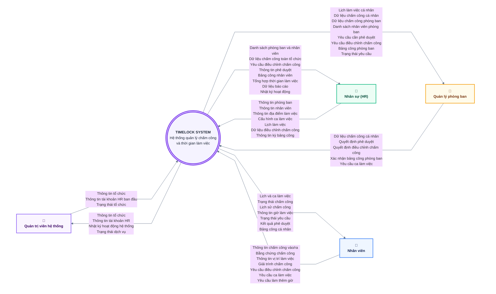

# TimeLock System - Context Diagram

```mermaid
%%{init: {
  "theme": "base",
  "flowchart": {
    "curve": "linear",
    "nodeSpacing": 70,
    "rankSpacing": 110,
    "htmlLabels": true
  },
  "themeVariables": {
    "fontFamily": "Arial",
    "fontSize": "14px",
    "lineColor": "#64748b",
    "textColor": "#1f2937"
  }
}}%%

flowchart LR

    %% =====================================================
    %% LEFT ACTORS
    %% =====================================================

    subgraph LEFT[" "]
        direction TB

        ADMIN["👤<br/><b>Quản trị viên hệ thống</b>"]

        EMPLOYEE["👤<br/><b>Nhân viên</b>"]
    end


    %% =====================================================
    %% TIMELOCK SYSTEM
    %% =====================================================

    subgraph CENTER[" "]
        direction TB

        TIMELOCK((("<b>TIMELOCK SYSTEM</b><br/>Hệ thống quản lý chấm công<br/>và thời gian làm việc")))
    end


    %% =====================================================
    %% RIGHT ACTORS
    %% =====================================================

    subgraph RIGHT[" "]
        direction TB

        HR["👤<br/><b>Nhân sự (HR)</b>"]

        MANAGER["👤<br/><b>Quản lý phòng ban</b>"]
    end


    %% =====================================================
    %% SYSTEM ADMIN
    %% =====================================================

    ADMIN -->|"Thông tin tổ chức<br/>Thông tin tài khoản HR ban đầu<br/>Trạng thái tổ chức"| TIMELOCK

    TIMELOCK -->|"Thông tin tổ chức<br/>Thông tin tài khoản HR<br/>Nhật ký hoạt động hệ thống<br/>Trạng thái dịch vụ"| ADMIN


    %% =====================================================
    %% EMPLOYEE
    %% =====================================================

    EMPLOYEE -->|"Thông tin chấm công vào/ra<br/>Bằng chứng chấm công<br/>Thông tin vị trí làm việc<br/>Giải trình chấm công<br/>Yêu cầu điều chỉnh chấm công<br/>Yêu cầu ca làm việc<br/>Yêu cầu làm thêm giờ"| TIMELOCK

    TIMELOCK -->|"Lịch và ca làm việc<br/>Trạng thái chấm công<br/>Lịch sử chấm công<br/>Thông tin giờ làm việc<br/>Trạng thái yêu cầu<br/>Kết quả phê duyệt<br/>Bảng công cá nhân"| EMPLOYEE


    %% =====================================================
    %% HR
    %% =====================================================

    HR -->|"Thông tin phòng ban<br/>Thông tin nhân viên<br/>Thông tin địa điểm làm việc<br/>Cấu hình ca làm việc<br/>Lịch làm việc<br/>Dữ liệu điều chỉnh chấm công<br/>Thông tin kỳ bảng công"| TIMELOCK

    TIMELOCK -->|"Danh sách phòng ban và nhân viên<br/>Dữ liệu chấm công toàn tổ chức<br/>Yêu cầu điều chỉnh chấm công<br/>Thông tin phê duyệt<br/>Bảng công nhân viên<br/>Tổng hợp thời gian làm việc<br/>Dữ liệu báo cáo<br/>Nhật ký hoạt động"| HR


    %% =====================================================
    %% DEPARTMENT MANAGER
    %% =====================================================

    MANAGER -->|"Dữ liệu chấm công cá nhân<br/>Quyết định phê duyệt<br/>Quyết định điều chỉnh chấm công<br/>Xác nhận bảng công phòng ban<br/>Yêu cầu ca làm việc"| TIMELOCK

    TIMELOCK -->|"Lịch làm việc cá nhân<br/>Dữ liệu chấm công cá nhân<br/>Dữ liệu chấm công phòng ban<br/>Danh sách nhân viên phòng ban<br/>Yêu cầu cần phê duyệt<br/>Yêu cầu điều chỉnh chấm công<br/>Bảng công phòng ban<br/>Trạng thái yêu cầu"| MANAGER


    %% =====================================================
    %% INVISIBLE LAYOUT LINKS
    %% Giữ actor trên / dưới cân đối
    %% =====================================================

    ADMIN ~~~ EMPLOYEE
    HR ~~~ MANAGER


    %% =====================================================
    %% STYLES
    %% =====================================================

    classDef adminActor fill:#faf5ff,stroke:#8b5cf6,stroke-width:2px,color:#3b0764;

    classDef hrActor fill:#ecfdf5,stroke:#10b981,stroke-width:2px,color:#064e3b;

    classDef managerActor fill:#fffbeb,stroke:#f59e0b,stroke-width:2px,color:#78350f;

    classDef employeeActor fill:#eff6ff,stroke:#3b82f6,stroke-width:2px,color:#172554;

    classDef systemNode fill:#f5f3ff,stroke:#7c3aed,stroke-width:3px,color:#1f2937;


    class ADMIN adminActor;
    class HR hrActor;
    class MANAGER managerActor;
    class EMPLOYEE employeeActor;
    class TIMELOCK systemNode;


    %% Ẩn viền các subgraph dùng để căn layout

    style LEFT fill:transparent,stroke:transparent
    style CENTER fill:transparent,stroke:transparent
    style RIGHT fill:transparent,stroke:transparent
```