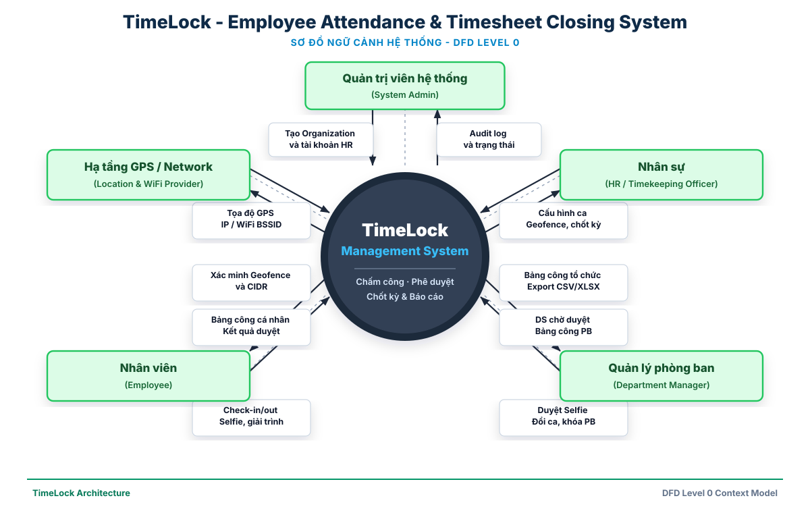
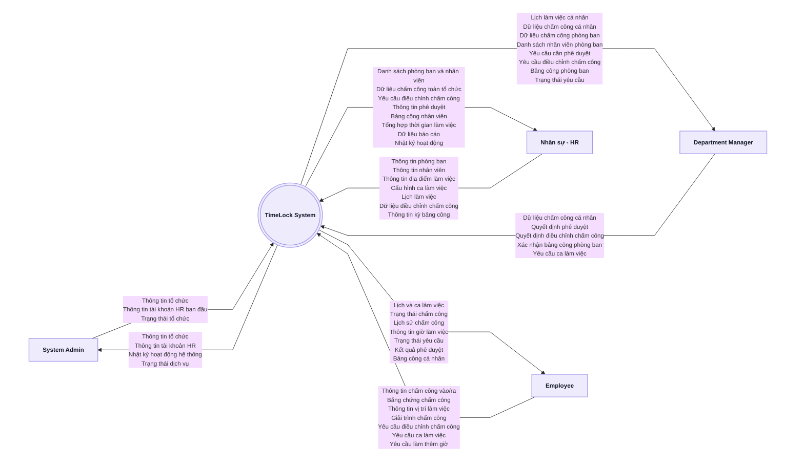

# TimeLock System - Context Diagram

> **Ghi chú:** Sơ đồ ngữ cảnh hệ thống (DFD Level 0) mô tả luồng tương tác hai chiều giữa TimeLock System và các actor bên ngoài. Có thể mở trực tiếp file vector sắc nét tại [TimeLock_Context_Diagram.svg](TimeLock_Context_Diagram.svg).

---

## Sơ đồ Mermaid (Source Code)

