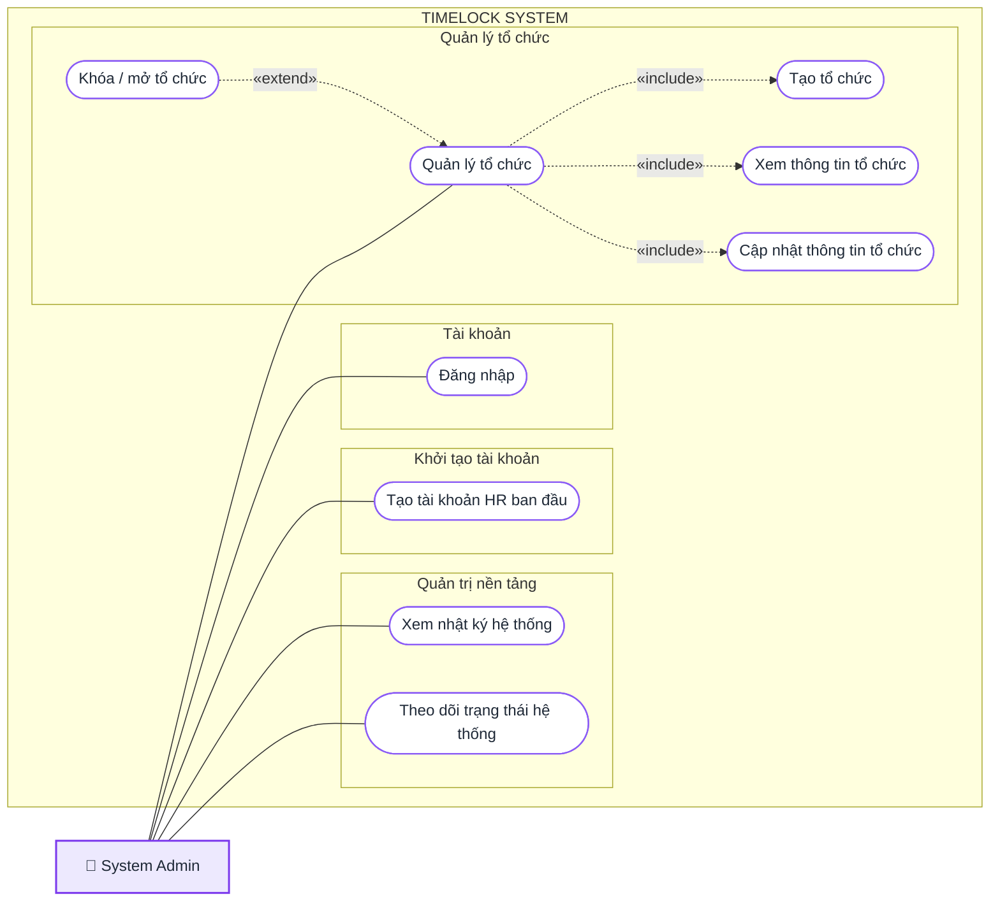
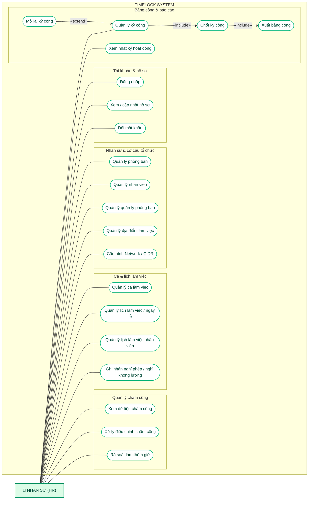
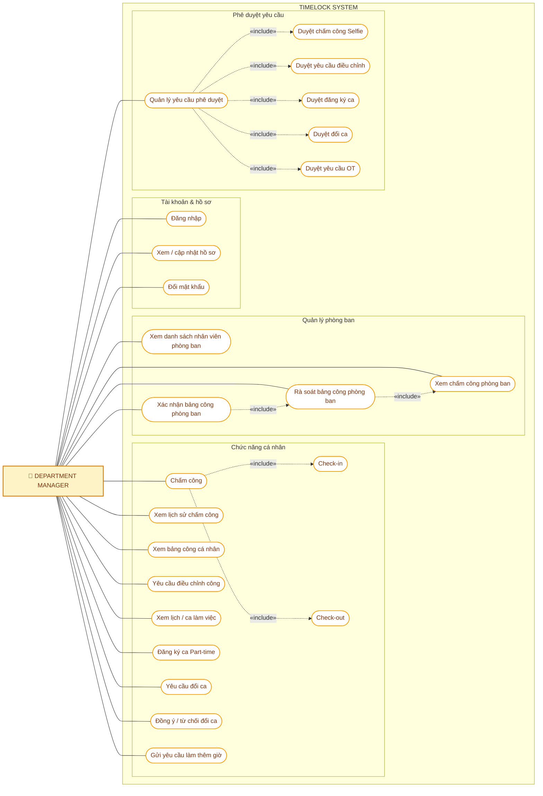
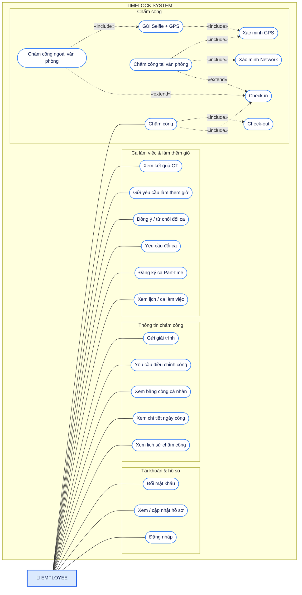

# TimeLock - Use Case Diagrams

Tài liệu mô tả các Use Case chính của hệ thống **TimeLock** theo từng vai trò người dùng.

---

# 1. System Admin

---

# 2. Nhân sự (HR)

---

# 3. Department Manager

---

# 4. Employee

---

## Quan hệ sử dụng

- `---` : Actor thực hiện Use Case.
- `«include»` : Use Case luôn cần sử dụng Use Case khác.
- `«extend»` : Use Case mở rộng/xảy ra trong điều kiện nhất định.
