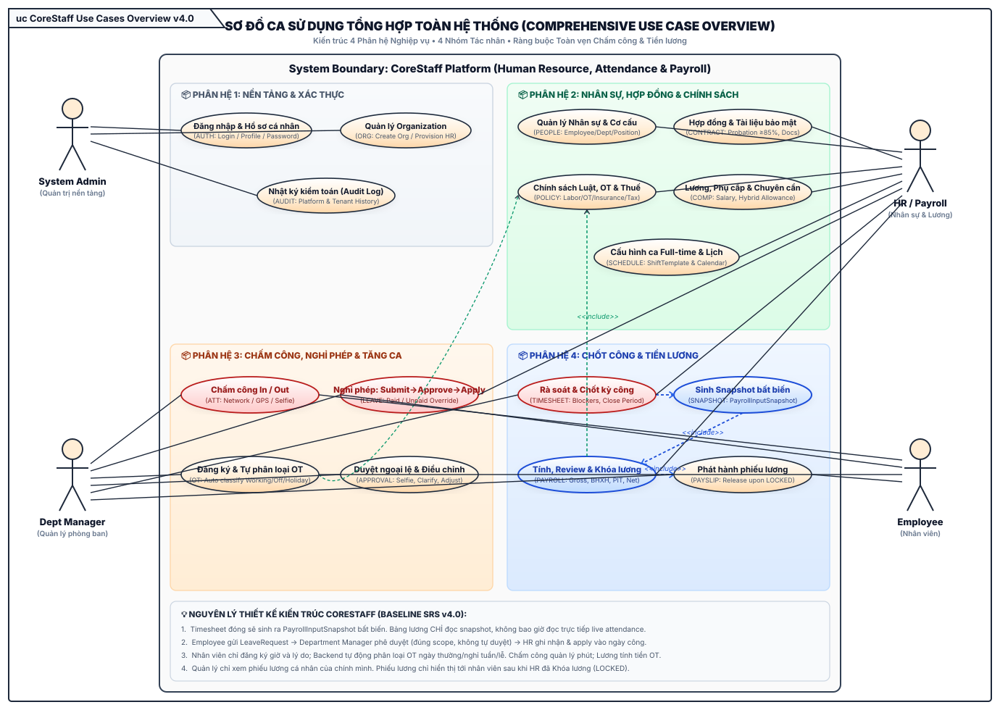
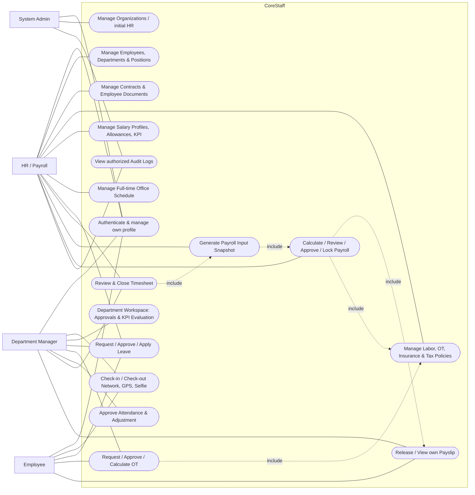

# CoreStaff — Use Case Diagram v4

> **Baseline:** SRS v4.0 — HRM & Payroll. Các sơ đồ đã được cập nhật sang định dạng vector SVG chuẩn kiến trúc v4.0.

### Danh sách các bản vẽ chi tiết theo vai trò (Vector SVG v4.0):
- [🗺️ Sơ đồ Use Case Tổng hợp toàn hệ thống (CoreStaff_Use_Case_Overview.svg)](CoreStaff_Use_Case_Overview.svg)
- [🛡️ Sơ đồ Ca sử dụng System Admin (Use_Case_Admin.svg)](Use_Case_Admin.svg)
- [📋 Sơ đồ Ca sử dụng HR & Payroll Officer (Use_Case_HR.svg)](Use_Case_HR.svg)
- [👔 Sơ đồ Ca sử dụng Department Manager (Use_Case_Manager.svg)](Use_Case_Manager.svg)
- [👤 Sơ đồ Ca sử dụng Employee (Use_Case_Employee.svg)](Use_Case_Employee.svg)

## System Admin
- Đăng nhập; quản lý Organization và HR đầu tiên.
- Theo dõi trạng thái nền tảng/audit.
- Không thực hiện nghiệp vụ chấm công, payroll và không xem lương tenant mặc định.

## HR / Payroll
- Quản lý EmployeeProfile, Department, Position, EmploymentContract, EmployeeDocument.
- Quản lý Full-time schedule/Calendar; apply LeaveRequest đã được Manager duyệt.
- Quản lý SalaryProfile, Allowance, attendance bonus, KPI input.
- Quản lý version của Labor/OT/Insurance/Tax Policy.
- Chốt/mở kỳ công; tạo/regenerate PayrollInputSnapshot.
- Tính, review, approve, lock, mark-paid Payroll; xuất báo cáo và phát hành Payslip.

## Department Manager
- Thực hiện ba chức năng cá nhân: Chấm công hôm nay, Lịch sử công, Nghỉ phép & OT bằng cùng một tài khoản.
- Workspace **Phòng ban** có hai tab **Phê duyệt** và **Đánh giá nhân sự**.
- Phê duyệt chỉ xử lý Selfie/ngoại lệ/adjustment/clarification và OT đúng scope; Network/GPS hợp lệ không phải duyệt từng ngày.
- Đánh giá nhân sự trong MVP là KPI kỳ lương: manager lưu DRAFT, HR CONFIRMED.
- Xem nhân viên và xử lý nghiệp vụ trong một/nhiều Department được giao qua ManagerAssignment; không tự duyệt.
- Xác nhận bảng công phòng ban; không xem lương hoặc dữ liệu nhạy cảm cả phòng.
- Responsive web desktop/mobile hoàn thành trước; Expo port sau khi Mốc Web được nghiệm thu.

## Employee
- Xem/cập nhật hồ sơ được phép.
- Chấm công Network/GPS/Selfie; xem lịch sử và bảng công.
- Gửi LeaveRequest, OT, adjustment và clarification.
- Xem Payslip của chính mình sau release.

## Scope exclusions
- Part-time, ShiftRegistration, ShiftSwap.
- Ca đêm/qua ngày, nhiều ca/ngày và OT đêm.
- Tuyển dụng, performance review, onboarding/offboarding đầy đủ.
- Chuyển khoản ngân hàng và quyết toán PIT năm.
